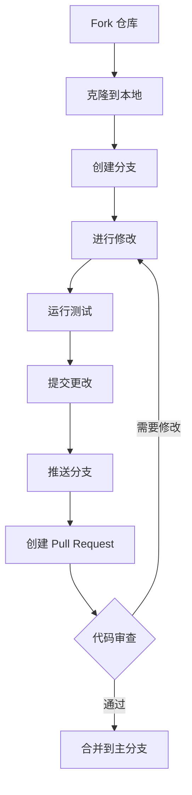

# 贡献指南

感谢您有兴趣为 DFA 项目做出贡献！本文档将帮助您了解如何参与项目开发。

---

## 目录

- [行为准则](#行为准则)
- [贡献流程](#贡献流程)
- [开发环境](#开发环境)
- [代码规范](#代码规范)
- [提交规范](#提交规范)
- [Pull Request 流程](#pull-request-流程)
- [问题报告](#问题报告)
- [功能建议](#功能建议)

---

## 行为准则

### 我们的承诺

为了营造一个开放和友好的环境，我们承诺：

- 尊重所有贡献者
- 接受建设性批评
- 关注对社区最有利的事情
- 对其他社区成员表示同理心

### 不可接受的行为

- 使用性化的语言或图像
- 骚扰、侮辱或贬损性评论
- 发布他人的私人信息
- 其他不道德或不专业的行为

---

## 贡献流程



### 快速开始

1. **Fork 仓库**
   - 点击 GitHub 页面右上角的 "Fork" 按钮

2. **克隆仓库**
   ```bash
   git clone https://github.com/YOUR_USERNAME/dfa.git
   cd dfa
   ```

3. **添加上游仓库**
   ```bash
   git remote add upstream https://github.com/your-org/dfa.git
   ```

4. **创建功能分支**
   ```bash
   git checkout -b feature/your-feature-name
   ```

5. **进行修改并提交**
   ```bash
   git add .
   git commit -m "feat: add your feature"
   ```

6. **推送分支**
   ```bash
   git push origin feature/your-feature-name
   ```

7. **创建 Pull Request**
   - 在 GitHub 上创建 Pull Request

---

## 开发环境

### 系统要求

| 要求 | 说明 |
|------|------|
| 操作系统 | Linux / macOS / Windows (WSL2) |
| JDK | OpenJDK 17+ |
| Android SDK | API 33+ |
| Gradle | 8.0+ |

### 环境搭建

```bash
# 1. 安装 JDK
# Ubuntu/Debian
sudo apt install openjdk-17-jdk

# macOS
brew install openjdk@17

# 2. 安装 Android SDK
# 下载并解压 command-line-tools
mkdir -p ~/android-sdk
unzip commandlinetools-linux-*.zip -d ~/android-sdk

# 3. 设置环境变量
export ANDROID_HOME=~/android-sdk
export PATH=$PATH:$ANDROID_HOME/cmdline-tools/latest/bin
export PATH=$PATH:$ANDROID_HOME/platform-tools

# 4. 安装必要组件
sdkmanager "platform-tools" "platforms;android-34" "build-tools;34.0.0"

# 5. 克隆项目
git clone https://github.com/your-org/dfa.git
cd dfa

# 6. 构建项目
./gradlew build
```

### Gradle Wrapper

本项目使用 Gradle Wrapper，无需预先安装 Gradle。

**Unix/macOS:**
```bash
./gradlew <task>
```

**Windows:**
```cmd
gradlew.bat <task>
```

**常用命令:**
```bash
# 构建项目
./gradlew build

# 清理构建
./gradlew clean

# 运行测试
./gradlew test

# 运行 lint 检查
./gradlew lint

# 运行 Detekt 检查
./gradlew detekt

# 查看所有任务
./gradlew tasks
```

**更新 Gradle Wrapper:**
```bash
./gradlew wrapper --gradle-version=8.6
```

### IDE 配置

推荐使用 Android Studio：

1. 安装最新版 Android Studio
2. 打开项目目录
3. 等待 Gradle 同步完成
4. 配置代码风格（Settings → Editor → Code Style）

---

## 代码规范

### Kotlin 代码风格

```kotlin
// 类定义
class ExampleClass(
    private val context: Context,
    private val config: Config
) {
    // 属性
    private val _state = MutableStateFlow<State>(State.Idle)
    val state: StateFlow<State> = _state.asStateFlow()
    
    // 公共方法
    fun doSomething(): Result<Unit> {
        return try {
            // 实现
            Result.success(Unit)
        } catch (e: Exception) {
            Result.failure(e)
        }
    }
    
    // 私有方法
    private fun internalMethod() {
        // 实现
    }
}

// 数据类
data class Config(
    val name: String,
    val value: Int = 0
)

// 密封类
sealed class State {
    object Idle : State()
    object Loading : State()
    data class Error(val message: String) : State()
}
```

### 命名规范

| 类型 | 规范 | 示例 |
|------|------|------|
| 类 | PascalCase | `VmManager` |
| 函数 | camelCase | `createVm()` |
| 变量 | camelCase | `vmInstance` |
| 常量 | UPPER_SNAKE_CASE | `MAX_RETRY_COUNT` |
| 资源 ID | snake_case | `btn_start` |

### 注释规范

```kotlin
/**
 * 虚拟机管理器，负责 VM 的生命周期管理。
 *
 * 使用示例：
 * ```kotlin
 * val manager = VmManager(context)
 * manager.createVm(config)
 * ```
 *
 * @property context Android 上下文
 * @author Your Name
 */
class VmManager(private val context: Context) {
    
    /**
     * 创建新的虚拟机实例。
     *
     * @param config VM 配置
     * @return 创建结果
     * @throws IllegalArgumentException 如果配置无效
     */
    fun createVm(config: VmConfig): Result<VmInstance> {
        // ...
    }
}
```

### 代码检查

```bash
# 运行 lint 检查
./gradlew lint

# 运行 ktlint 检查
./gradlew ktlintCheck

# 自动修复格式问题
./gradlew ktlintFormat
```

---

## 提交规范

### 提交信息格式

```
<type>(<scope>): <subject>

<body>

<footer>
```

### Type 类型

| 类型 | 说明 | 示例 |
|------|------|------|
| `feat` | 新功能 | `feat(vm): add snapshot support` |
| `fix` | Bug 修复 | `fix(docker): resolve memory leak` |
| `docs` | 文档更新 | `docs: update installation guide` |
| `style` | 代码格式 | `style: format code` |
| `refactor` | 重构 | `refactor(vm): optimize startup` |
| `test` | 测试 | `test: add unit tests for VmManager` |
| `chore` | 构建/工具 | `chore: update dependencies` |

### Scope 范围

| 范围 | 说明 |
|------|------|
| `vm` | 虚拟机相关 |
| `docker` | Docker 相关 |
| `network` | 网络相关 |
| `storage` | 存储相关 |
| `ui` | 用户界面 |
| `api` | API 相关 |

### 提交示例

```
feat(vm): add VM snapshot support

- Add snapshot creation API
- Add snapshot restoration API
- Add snapshot deletion API
- Add unit tests for snapshot functionality

Closes #123
```

---

## Pull Request 流程

### PR 检查清单

在提交 PR 前，请确保：

- [ ] 代码通过所有测试
- [ ] 代码通过 lint 检查
- [ ] 代码有适当的注释
- [ ] 提交信息符合规范
- [ ] 更新了相关文档
- [ ] 添加了必要的测试

### PR 标题格式

```
<type>(<scope>): <description>
```

示例：
- `feat(vm): add VM snapshot support`
- `fix(docker): resolve container startup issue`
- `docs: update API reference`

### PR 描述模板

```markdown
## 变更类型
- [ ] 新功能
- [ ] Bug 修复
- [ ] 重构
- [ ] 文档更新
- [ ] 其他

## 变更说明
[描述此 PR 的变更内容]

## 相关 Issue
Closes #xxx

## 测试说明
[描述如何测试此变更]

## 截图
[如有必要，添加截图]

## 检查清单
- [ ] 代码通过测试
- [ ] 代码通过 lint
- [ ] 更新了文档
- [ ] 添加了测试
```

### 代码审查

所有 PR 都需要至少一位维护者审查后才能合并。

审查重点：
- 代码质量和可读性
- 是否符合项目架构
- 是否有潜在问题
- 测试覆盖率
- 文档完整性

---

## 问题报告

### 报告前检查

在提交 Issue 前，请：

1. 搜索现有 Issue，确认问题未被报告
2. 尝试使用最新版本复现问题
3. 收集必要的诊断信息

### Issue 模板

```markdown
## 问题描述
[简要描述问题]

## 环境信息
- 设备型号：
- Android 版本：
- DFA 版本：

## 复现步骤
1. 
2. 
3. 

## 期望结果
[描述期望的行为]

## 实际结果
[描述实际发生的情况]

## 日志
```
[粘贴相关日志]
```

## 截图
[如有必要，添加截图]
```

---

## 功能建议

### 建议模板

```markdown
## 功能描述
[描述建议的功能]

## 使用场景
[描述功能的使用场景]

## 期望行为
[描述功能的期望行为]

## 替代方案
[描述考虑过的替代方案]

## 附加信息
[其他相关信息]
```

---

## 联系方式

- GitHub Issues: https://github.com/your-org/dfa/issues
- GitHub Discussions: https://github.com/your-org/dfa/discussions
- 邮件: dfa-team@example.com

---

感谢您的贡献！