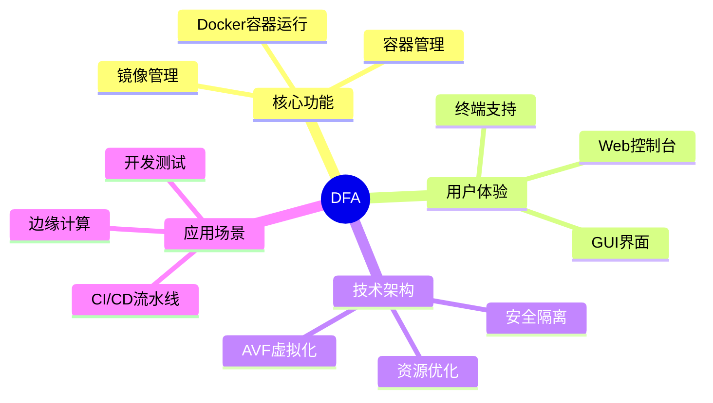
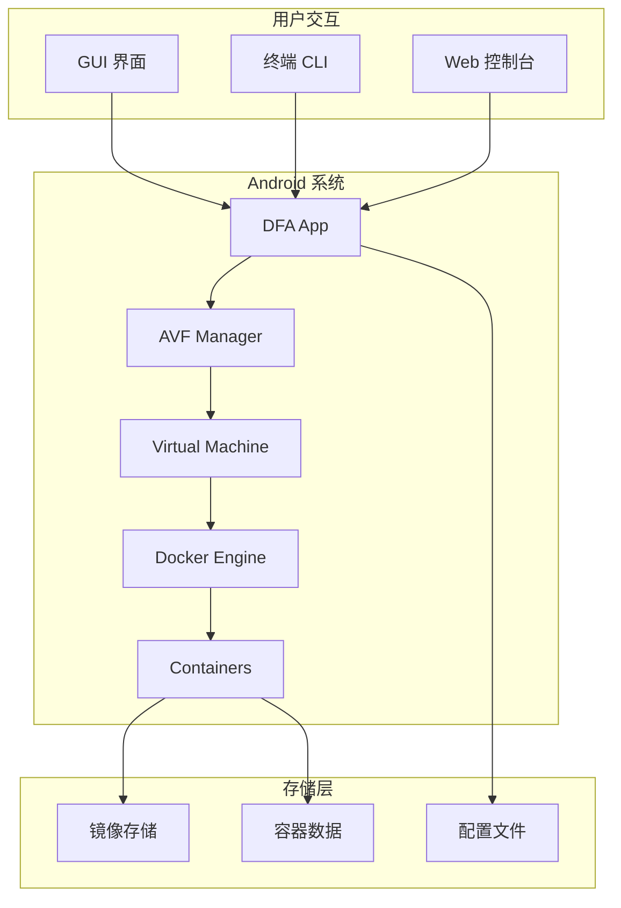

# DFA - Docker For Android

<div align="center">


**基于 Android Virtualization Framework 的 Docker 容器解决方案**

[](LICENSE)
[](https://www.android.com/)
[](https://www.docker.com/)

[快速开始](#快速开始) • [文档](#文档导航) • [贡献指南](CONTRIBUTING.md) • [常见问题](docs/FAQ.md)

</div>

---

## 项目简介

DFA（Docker For Android）是一个创新性的开源项目，利用 Android 的 AVF（Android Virtualization Framework）框架，在 Android 设备上实现原生 Docker 容器支持。

### 核心特性

- **原生 Docker 支持**：在 Android 设备上运行完整的 Docker 容器
- **AVF 架构**：基于 Android 虚拟化框架，提供安全隔离的容器环境
- **图形界面**：提供直观的 Android GUI 应用，方便容器管理
- **终端访问**：支持通过终端直接操作 Docker 命令
- **安全隔离**：利用虚拟化技术实现容器与宿主系统的安全隔离
- **轻量高效**：优化的资源使用，适合移动设备运行

### 项目目标



---

## 快速开始

### 系统要求

| 要求 | 说明 |
|------|------|
| Android 版本 | Android 13 (API 33) 或更高 |
| 设备架构 | ARM64 (aarch64) |
| 内核支持 | 需要 KVM 和相关虚拟化支持 |
| 存储空间 | 至少 2GB 可用空间 |
| 内存 | 建议 4GB 以上 |

### 安装步骤

1. **下载 APK**
   ```bash
   # 从 GitHub Releases 下载最新版本
   wget https://github.com/your-org/dfa/releases/latest/dfa.apk
   ```

2. **安装应用**
   ```bash
   adb install dfa.apk
   ```

3. **初始化环境**
   ```bash
   # 打开应用，按照向导完成初始化
   # 或通过命令行初始化
   dfa init
   ```

4. **验证安装**
   ```bash
   dfa version
   dfa docker --version
   ```

### 快速示例

```bash
# 运行第一个容器
dfa docker run hello-world

# 运行 Nginx 服务
dfa docker run -d -p 8080:80 nginx

# 查看运行中的容器
dfa docker ps
```

---

## 架构概述



### 核心组件

| 组件 | 说明 |
|------|------|
| DFA App | Android 应用，提供用户界面和核心功能 |
| AVF Manager | 管理 Android Virtualization Framework 的虚拟机 |
| Docker Engine | 在虚拟机中运行的 Docker 引擎 |
| Container Runtime | 容器运行时环境 |

---

## 文档导航

| 文档 | 说明 |
|------|------|
| [架构文档](docs/ARCHITECTURE.md) | 详细的技术架构说明 |
| [安装指南](docs/INSTALLATION.md) | 完整的安装和配置指南 |
| [开发指南](docs/DEVELOPMENT.md) | 开发者贡献指南 |
| [AVF 指南](docs/AVF-GUIDE.md) | Android Virtualization Framework 使用指南 |
| [Docker 集成](docs/DOCKER-INTEGRATION.md) | Docker 与 AVF 的集成说明 |
| [故障排除](docs/TROUBLESHOOTING.md) | 常见问题和解决方案 |
| [FAQ](docs/FAQ.md) | 常见问题解答 |
| [API 参考](docs/API-REFERENCE.md) | API 接口文档 |
| [设备支持](docs/DEVICE-SUPPORT.md) | 支持的设备列表 |
| [性能指南](docs/PERFORMANCE.md) | 性能优化建议 |
| [安全指南](docs/SECURITY.md) | 安全最佳实践 |
| [路线图](docs/ROADMAP.md) | 项目发展规划 |

---

## 贡献指南

我们欢迎所有形式的贡献！请参阅 [贡献指南](CONTRIBUTING.md) 了解如何参与项目开发。

### 贡献方式

- 报告 Bug 或提出功能建议
- 提交代码改进
- 完善文档
- 分享使用经验

---

## 许可证

本项目采用 Apache License 2.0 许可证。详见 [LICENSE](LICENSE) 文件。

---

## 致谢

- [Android Virtualization Framework](https://source.android.com/docs/core/virtualization) - 提供底层虚拟化支持
- [Docker](https://www.docker.com/) - 容器运行时
- [所有贡献者](https://github.com/your-org/dfa/graphs/contributors) - 感谢每一位贡献者

---

<div align="center">

**[⬆ 返回顶部](#dfa---docker-for-android)**

Made with ❤️ by DFA Team

</div>