# DFA 技术架构文档

本文档详细描述 DFA（Docker For Android）项目的技术架构设计。

---

## 目录

- [概述](#概述)
- [AVF 架构基础](#avf-架构基础)
- [DFA 系统架构](#dfa-系统架构)
- [核心组件](#核心组件)
- [数据流](#数据流)
- [安全架构](#安全架构)
- [性能架构](#性能架构)

---

## 概述

DFA 利用 Android 的 AVF（Android Virtualization Framework）在 Android 设备上创建隔离的虚拟机环境，并在其中运行 Docker 引擎，从而实现原生 Docker 容器支持。

### 设计目标

| 目标 | 说明 |
|------|------|
| 安全隔离 | 容器与宿主系统完全隔离 |
| 性能优化 | 最小化虚拟化开销 |
| 易用性 | 提供直观的用户界面 |
| 兼容性 | 支持标准 Docker 镜像和命令 |
| 可扩展 | 支持插件和扩展机制 |

---

## AVF 架构基础

### 什么是 AVF

Android Virtualization Framework (AVF) 是 Android 13 引入的虚拟化框架，允许在 Android 设备上运行受保护的虚拟机。

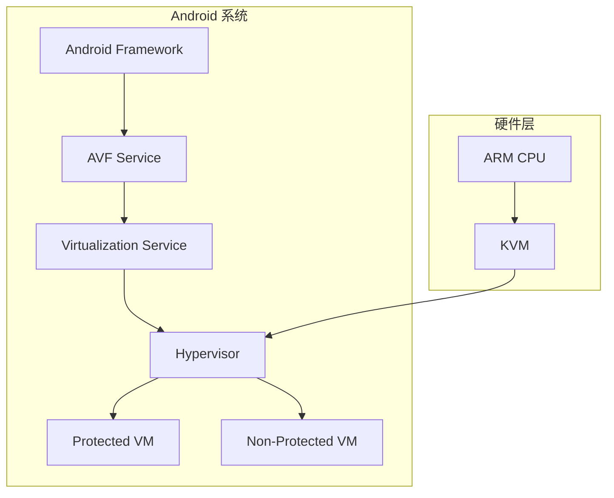

### AVF 核心概念

| 概念 | 说明 |
|------|------|
| Protected VM (pVM) | 受保护的虚拟机，与宿主系统隔离 |
| Non-Protected VM | 非保护虚拟机，性能更高但隔离性较弱 |
| Hypervisor | 管理虚拟机的软件层 |
| Crosvm | Chrome OS 的虚拟机监视器，AVF 使用其变体 |
| VirtIO | 虚拟设备接口标准 |

### AVF 组件

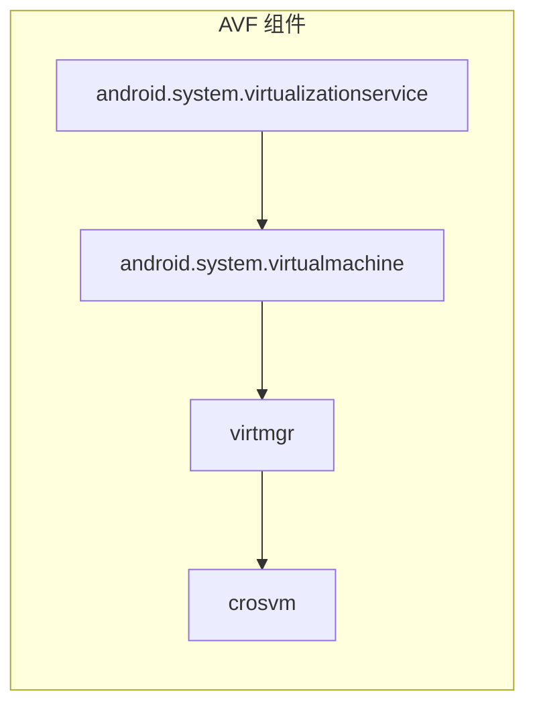

---

## DFA 系统架构

### 整体架构

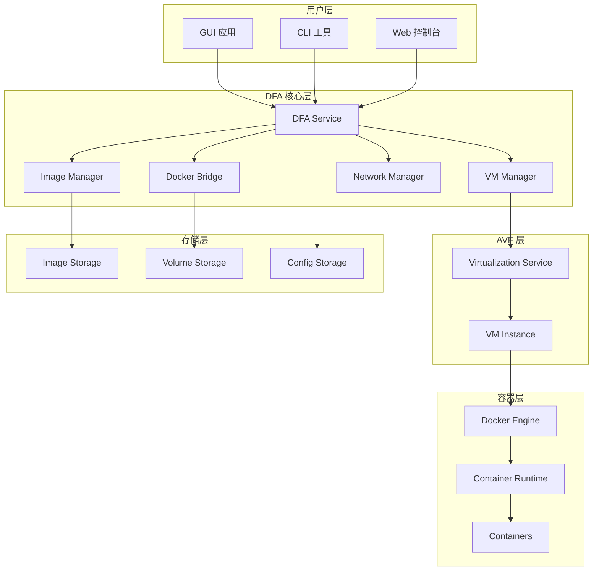

### 架构层次

| 层次 | 组件 | 职责 |
|------|------|------|
| 用户层 | GUI/CLI/Web | 用户交互界面 |
| 核心层 | DFA Service | 核心业务逻辑 |
| 虚拟化层 | AVF | 虚拟机管理 |
| 容器层 | Docker | 容器运行时 |
| 存储层 | Storage | 数据持久化 |

---

## 核心组件

### 1. DFA Service

DFA 的核心服务，负责协调各组件工作。

```java
// DFA Service 核心接口
public interface DfaService {
    // 生命周期管理
    void initialize(Context context);
    void start();
    void stop();
    
    // VM 管理
    VmInstance createVm(VmConfig config);
    void destroyVm(VmInstance vm);
    
    // Docker 操作
    DockerClient getDockerClient();
}
```

### 2. VM Manager

管理虚拟机的创建、启动、停止和销毁。

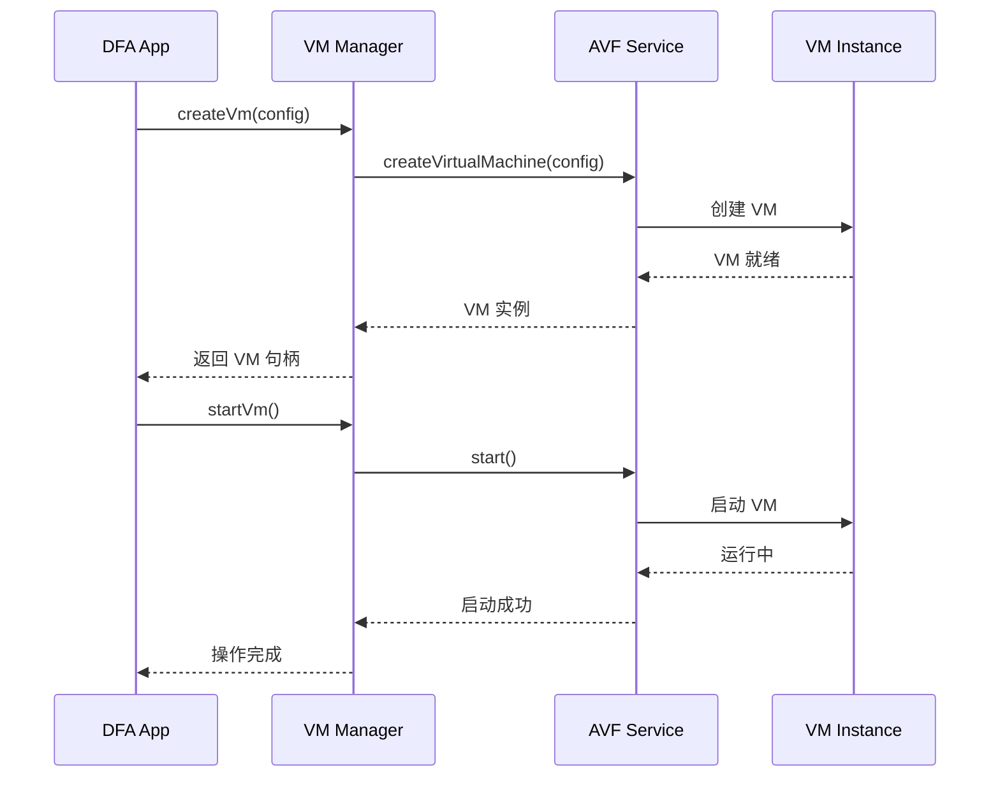

### 3. Docker Bridge

Docker 与 Android 系统的桥接层。

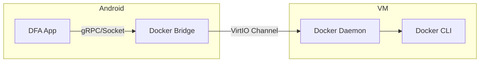

### 4. Image Manager

管理 Docker 镜像的拉取、存储和分发。

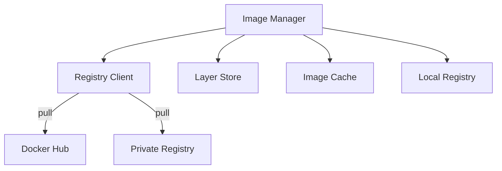

### 5. Network Manager

管理容器网络配置。

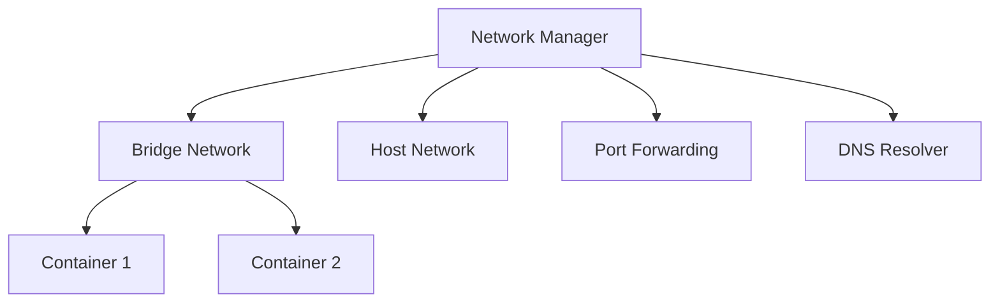

---

## 数据流

### 容器创建流程

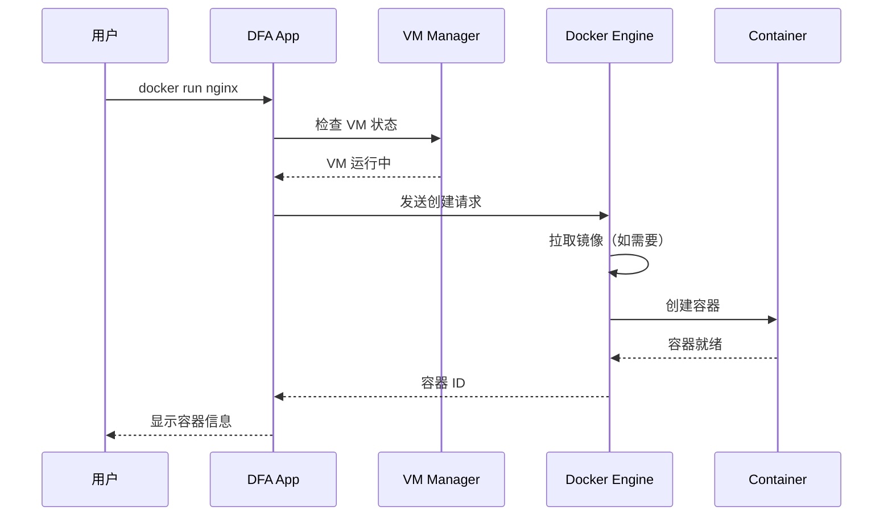

### 镜像拉取流程

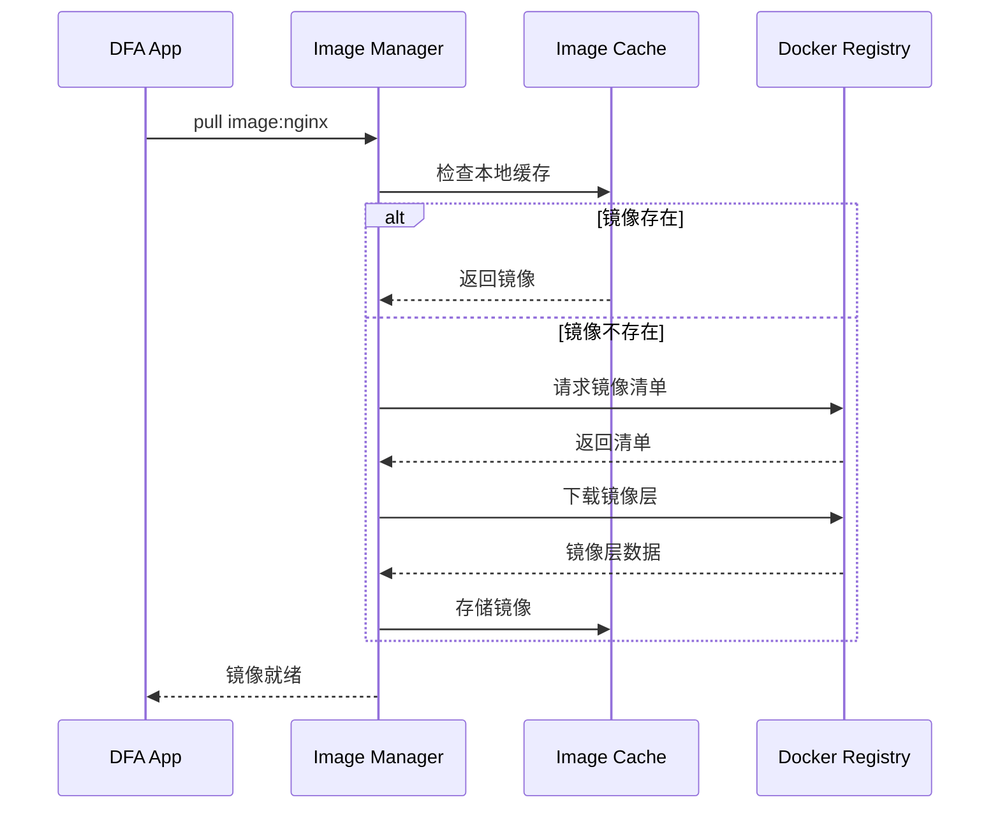

---

## 安全架构

### 安全模型

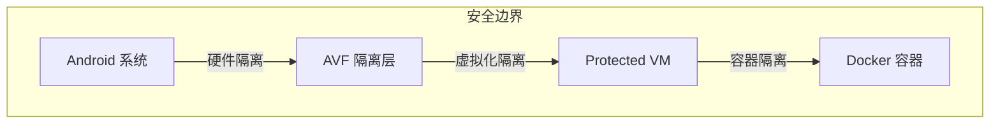

### 安全层次

| 层次 | 机制 | 说明 |
|------|------|------|
| 硬件层 | ARM TrustZone | 硬件级安全隔离 |
| 虚拟化层 | AVF Protected VM | 虚拟机级隔离 |
| 容器层 | Docker Namespaces | 容器级隔离 |
| 应用层 | SELinux/AppArmor | 强制访问控制 |

### 安全特性

1. **内存隔离**：虚拟机拥有独立的内存空间
2. **存储隔离**：容器数据存储在虚拟机磁盘镜像中
3. **网络隔离**：虚拟机网络与宿主网络隔离
4. **权限控制**：细粒度的权限管理机制

---

## 性能架构

### 性能优化策略

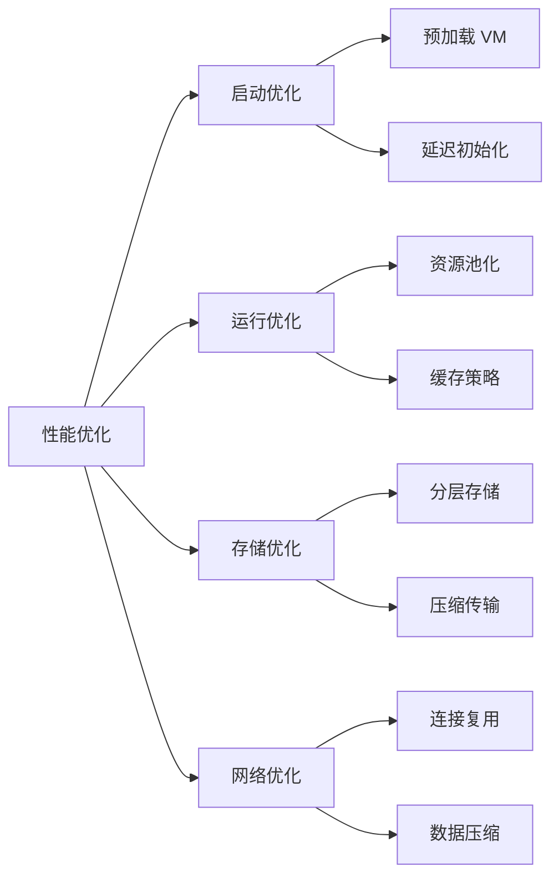

### 资源管理

| 资源 | 管理策略 |
|------|----------|
| CPU | 动态分配，按需调整 |
| 内存 | 预留 + 动态扩展 |
| 存储 | 分层存储，自动清理 |
| 网络 | 按需分配，带宽限制 |

---

## 扩展架构

### 插件系统

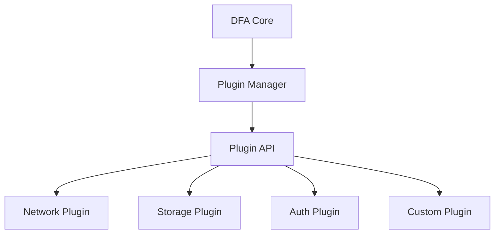

### 扩展点

| 扩展点 | 说明 |
|--------|------|
| Network Driver | 自定义网络驱动 |
| Storage Driver | 自定义存储驱动 |
| Auth Provider | 自定义认证提供者 |
| Log Driver | 自定义日志驱动 |
| Metric Collector | 自定义指标收集器 |

---

## 相关文档

- [安装指南](INSTALLATION.md)
- [开发指南](DEVELOPMENT.md)
- [AVF 指南](AVF-GUIDE.md)
- [Docker 集成](DOCKER-INTEGRATION.md)
- [安全指南](SECURITY.md)