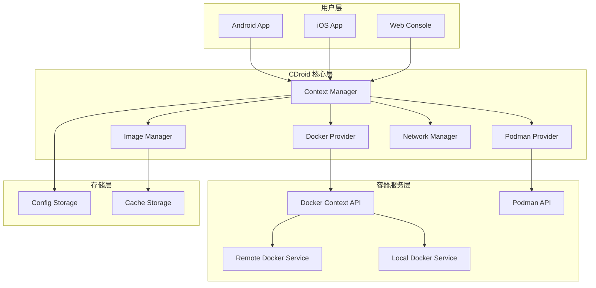
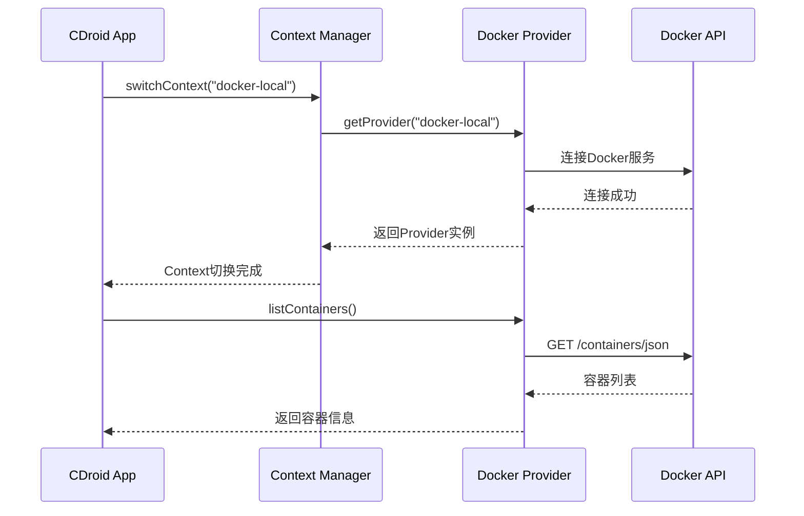
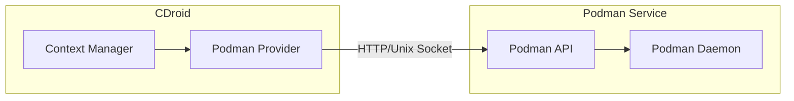
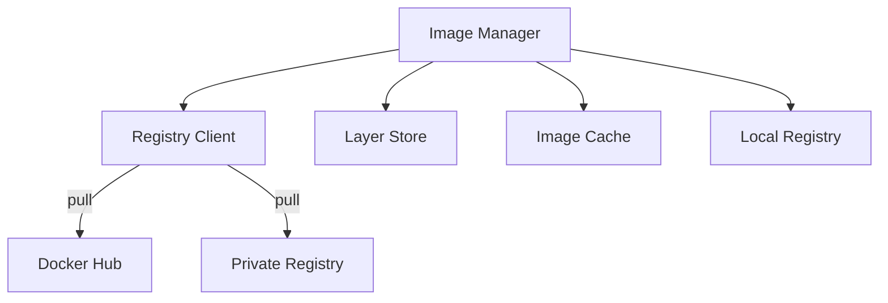
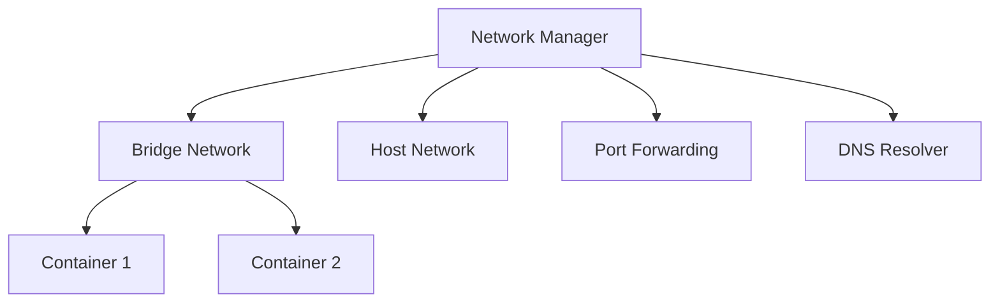
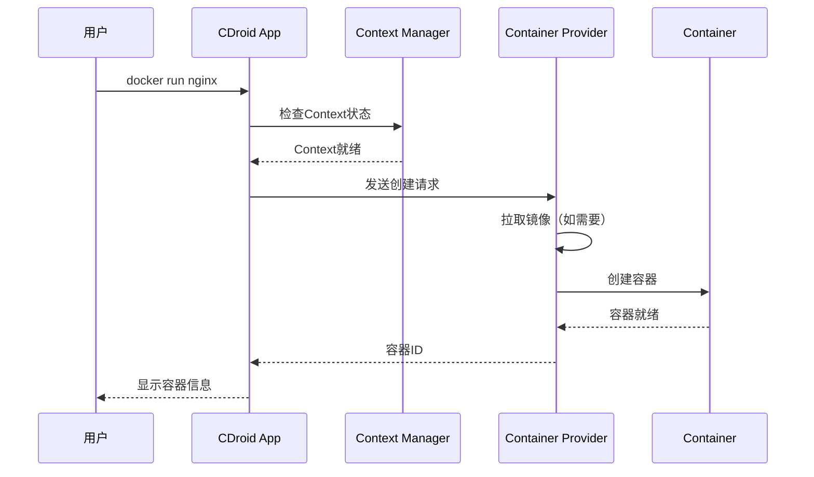
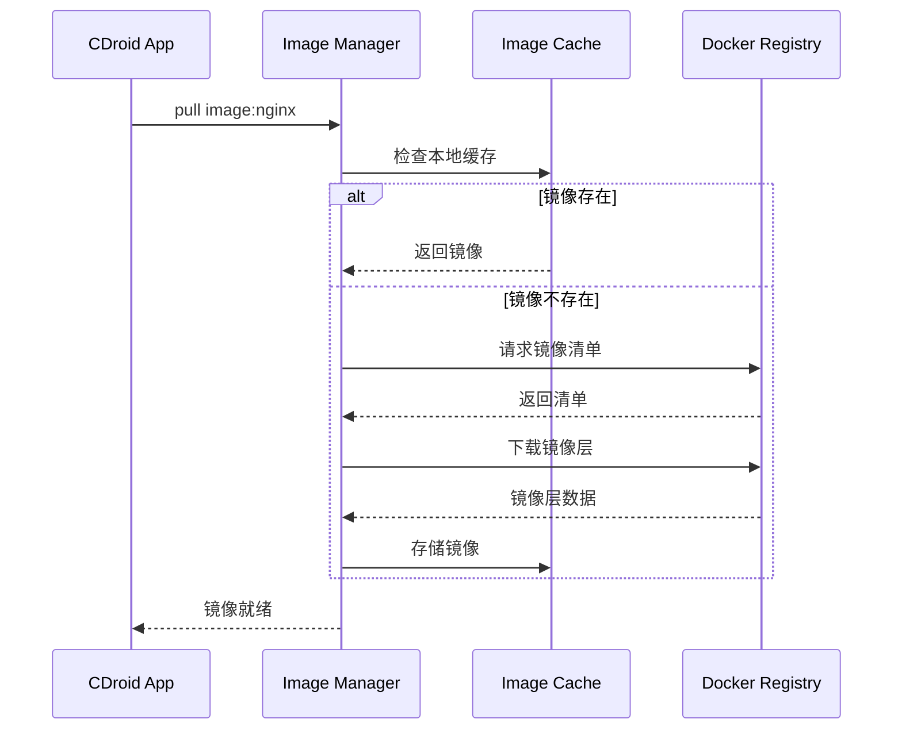
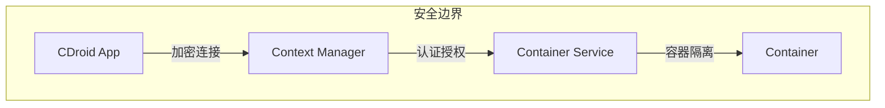
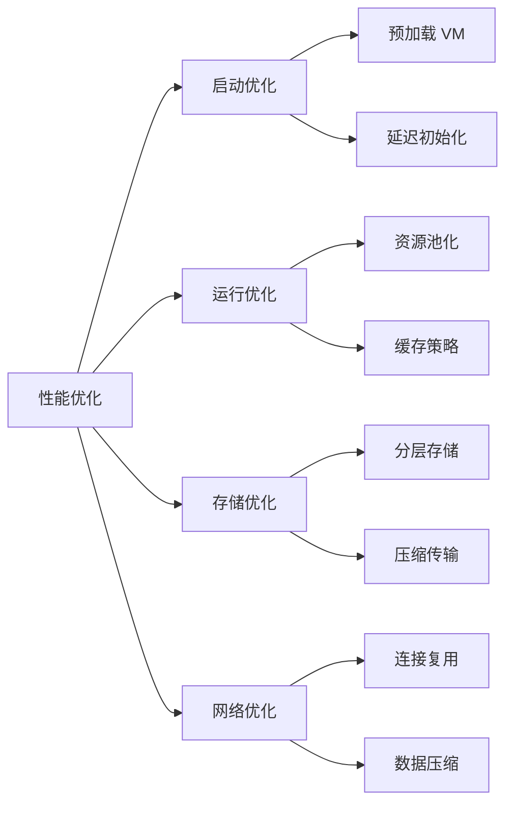
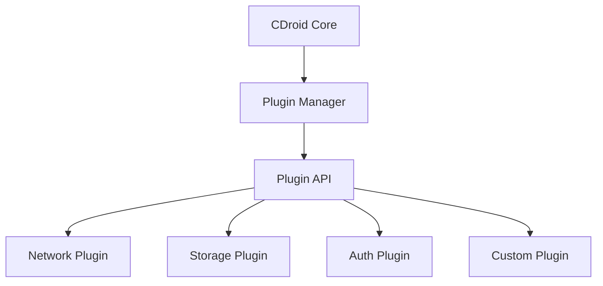

# CDroid 技术架构文档

本文档详细描述 CDroid（Container Dashboard）项目的技术架构设计。

---

## 目录

- [概述](#概述)
- [CDroid 系统架构](#cdroid-系统架构)
- [核心组件](#核心组件)
- [数据流](#数据流)
- [安全架构](#安全架构)
- [性能架构](#性能架构)

---

## 概述

CDroid 通过 Docker Context 和容器服务 API 管理远程或本地的 Docker、Podman 等容器服务。通过统一的用户界面，提供跨平台的容器管理能力。

### 设计目标

| 目标 | 说明 |
|------|------|
| 跨平台支持 | 支持Android、iOS、Web等多平台 |
| 多服务支持 | 支持Docker、Podman等多种容器服务 |
| 远程管理 | 支持连接和管理远程容器服务 |
| 易用性 | 提供直观的用户界面 |
| 可扩展 | 支持插件和扩展机制 |

---

## CDroid 系统架构

### 整体架构



### 架构层次

| 层次 | 组件 | 职责 |
|------|------|------|
| 用户层 | Android/iOS/Web | 用户交互界面 |
| 核心层 | CDroid Service | 核心业务逻辑 |
| 服务层 | Docker/Podman API | 容器服务接口 |
| 存储层 | Storage | 数据持久化 |

---

## 核心组件

### 1. Context Manager

Context Manager负责管理Docker Context的配置、切换和连接。

```kotlin
// Context Manager 核心接口
interface ContextManager {
    // 生命周期管理
    suspend fun initialize(context: Context)
    suspend fun start()
    suspend fun stop()
    
    // Context 管理
    suspend fun createContext(config: ContextConfig): Context
    suspend fun destroyContext(contextId: String)
    suspend fun switchContext(contextId: String)
    suspend fun listContexts(): List<Context>
    
    // Provider 管理
    suspend fun getProvider(contextId: String): ContainerProvider
}
```

### 2. Docker Provider

Docker Provider提供Docker服务的API封装和操作功能。



### 3. Podman Provider

Podman Provider提供Podman服务的API封装和操作功能。



### 4. Image Manager

管理容器镜像的拉取、存储和分发。



### 5. Network Manager

管理容器网络配置。



---

## 数据流

### 容器创建流程



### 镜像拉取流程



---

## 安全架构

### 安全模型



### 安全层次

| 层次 | 机制 | 说明 |
|------|------|------|
| 传输层 | TLS/SSL | 加密通信 |
| 认证层 | Token/Cert | 身份认证 |
| 授权层 | RBAC | 访问控制 |
| 容器层 | Namespaces | 容器级隔离 |

### 安全特性

1. **加密通信**：所有与容器服务的通信都使用TLS加密
2. **认证授权**：支持多种认证方式（Token、证书、OAuth）
3. **权限控制**：细粒度的权限管理机制
4. **审计日志**：记录所有操作日志

---

## 性能架构

### 性能优化策略



### 资源管理

| 资源 | 管理策略 |
|------|----------|
| CPU | 动态分配，按需调整 |
| 内存 | 预留 + 动态扩展 |
| 存储 | 分层存储，自动清理 |
| 网络 | 按需分配，带宽限制 |

---

## 扩展架构

### 插件系统



### 扩展点

| 扩展点 | 说明 |
|--------|------|
| Network Driver | 自定义网络驱动 |
| Storage Driver | 自定义存储驱动 |
| Auth Provider | 自定义认证提供者 |
| Log Driver | 自定义日志驱动 |
| Metric Collector | 自定义指标收集器 |

---

## 相关文档

- [安装指南](INSTALLATION.md)
- [开发指南](DEVELOPMENT.md)
- [AVF 指南](AVF-GUIDE.md)
- [Docker 集成](DOCKER-INTEGRATION.md)
- [安全指南](SECURITY.md)