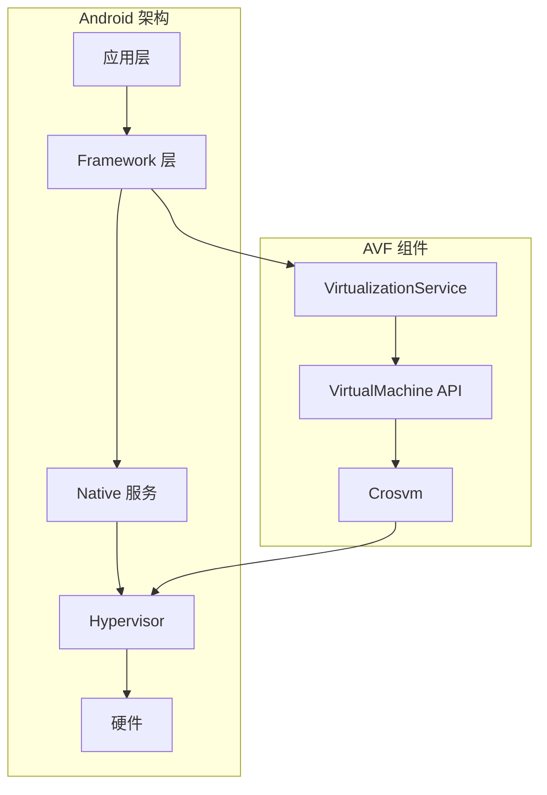
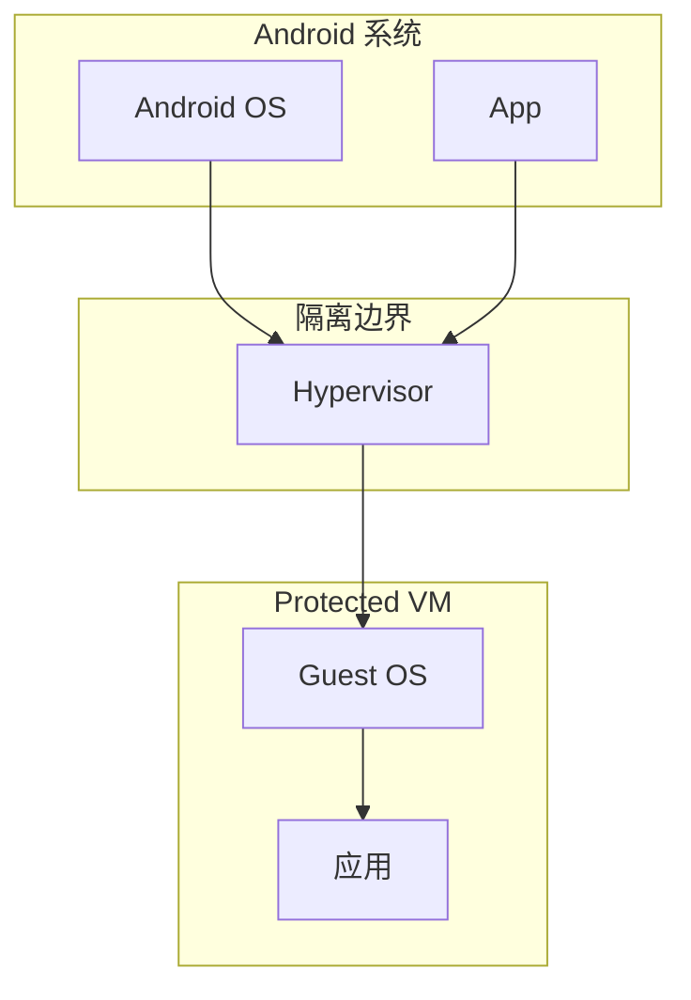
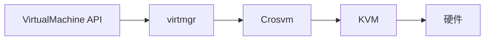
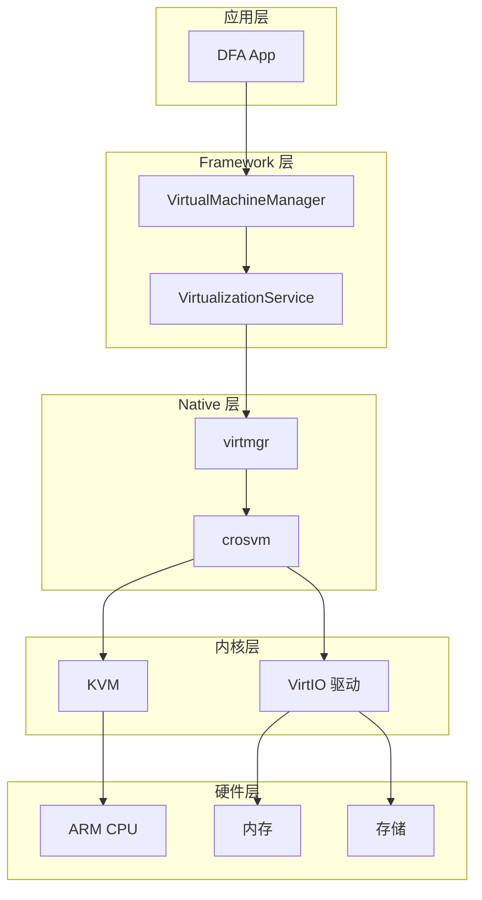
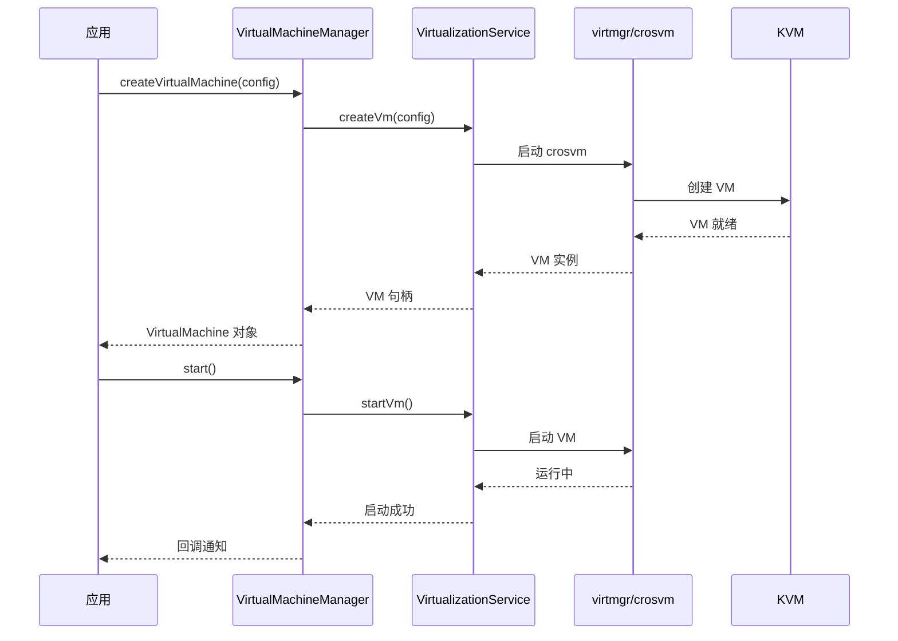
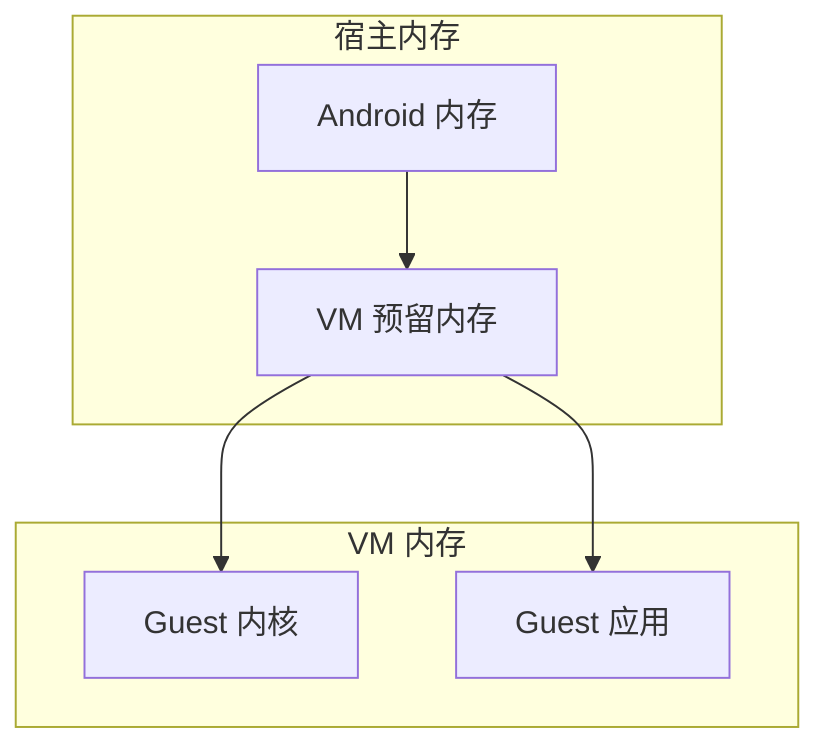

# AVF 框架指南

本文档详细介绍 Android Virtualization Framework (AVF) 的核心概念、API 使用和最佳实践。

---

## 目录

- [AVF 概述](#avf-概述)
- [核心概念](#核心概念)
- [架构原理](#架构原理)
- [API 使用](#api-使用)
- [虚拟机配置](#虚拟机配置)
- [最佳实践](#最佳实践)
- [故障排除](#故障排除)

---

## AVF 概述

### 什么是 AVF

Android Virtualization Framework (AVF) 是 Android 13 引入的虚拟化框架，允许在 Android 设备上安全地运行虚拟机。



### AVF 特性

| 特性 | 说明 |
|------|------|
| 安全隔离 | 虚拟机与宿主系统完全隔离 |
| 硬件加速 | 利用 ARM 虚拟化扩展 |
| 受保护 VM | 支持 pVM (Protected VM) |
| 标准接口 | 提供标准的 Android API |
| 灵活配置 | 支持自定义 VM 配置 |

### 适用场景

- **安全计算**：处理敏感数据
- **容器运行时**：运行 Docker 容器
- **沙箱环境**：隔离执行不可信代码
- **多系统**：在同一设备运行多个操作系统

---

## 核心概念

### Protected VM (pVM)

Protected VM 是 AVF 的核心概念，提供硬件级别的安全隔离。



### pVM 特性

| 特性 | 说明 |
|------|------|
| 内存隔离 | VM 拥有独立的加密内存 |
| 存储隔离 | VM 拥有独立的加密存储 |
| 网络隔离 | VM 拥有独立的网络栈 |
| 硬件隔离 | 利用 TrustZone 技术 |

### Non-Protected VM

Non-Protected VM 提供更高的性能，但隔离性较弱。

```kotlin
// 创建 Non-Protected VM
val config = VirtualMachineConfig.Builder()
    .setProtectedVm(false)  // 设置为非保护 VM
    .setMemoryBytes(1024 * 1024 * 1024)  // 1GB 内存
    .build()
```

### Crosvm

Crosvm 是 AVF 使用的虚拟机监视器 (VMM)。



### VirtIO

VirtIO 是虚拟设备的标准接口。

| 设备类型 | VirtIO 驱动 | 说明 |
|----------|-------------|------|
| 网络 | virtio-net | 虚拟网络设备 |
| 存储 | virtio-blk | 虚拟块设备 |
| 控制台 | virtio-console | 虚拟控制台 |
| 串口 | virtio-serial | 虚拟串口 |
| 输入 | virtio-input | 虚拟输入设备 |

---

## 架构原理

### 系统架构



### 启动流程



### 内存管理



---

## API 使用

### 基本使用

#### 1. 添加依赖

```kotlin
// build.gradle.kts
dependencies {
    implementation("android.system.virtualizationservice:virtualizationservice:1.0")
}
```

#### 2. 创建虚拟机

```kotlin
import android.system.virtualmachine.VirtualMachine
import android.system.virtualmachine.VirtualMachineConfig
import android.system.virtualmachine.VirtualMachineManager

class VmManager(private val context: Context) {
    private val vmm = context.getSystemService(VirtualMachineManager::class.java)
    
    fun createVm(name: String, config: VirtualMachineConfig): VirtualMachine {
        return vmm.create(name, config)
    }
    
    fun getVm(name: String): VirtualMachine? {
        return vmm.get(name)
    }
    
    fun deleteVm(name: String) {
        vmm.delete(name)
    }
}
```

#### 3. 配置虚拟机

```kotlin
fun createConfig(context: Context): VirtualMachineConfig {
    return VirtualMachineConfig.Builder(context)
        .setProtectedVm(true)  // 使用 Protected VM
        .setMemoryBytes(1024 * 1024 * 1024)  // 1GB 内存
        .setCpuCount(2)  // 2 个 CPU
        .setApkPath(context.packageCodePath)  // APK 路径
        .setPayloadBinaryName("vm_payload")  // payload 二进制名
        .build()
}
```

#### 4. 启动虚拟机

```kotlin
fun startVm(vm: VirtualMachine, callback: VmCallback) {
    vm.run(callback, context.mainExecutor)
}

class VmCallback : VirtualMachineCallback {
    override fun onPayloadStarted(vm: VirtualMachine) {
        Log.d("VM", "Payload started")
    }
    
    override fun onPayloadReady(vm: VirtualMachine) {
        Log.d("VM", "Payload ready")
    }
    
    override fun onPayloadFinished(vm: VirtualMachine, exitCode: Int) {
        Log.d("VM", "Payload finished with code: $exitCode")
    }
    
    override fun onError(vm: VirtualMachine, errorCode: Int, message: String) {
        Log.e("VM", "Error: $message (code: $errorCode)")
    }
}
```

### 高级 API

#### 与 VM 通信

```kotlin
// 使用 VirtIO 串口通信
fun communicateWithVm(vm: VirtualMachine): ParcelFileDescriptor? {
    return vm.connectVsock(port)
}

// 发送数据
fun sendData(fd: ParcelFileDescriptor, data: ByteArray) {
    val output = FileOutputStream(fd.fileDescriptor)
    output.write(data)
    output.flush()
}

// 接收数据
fun receiveData(fd: ParcelFileDescriptor): ByteArray {
    val input = FileInputStream(fd.fileDescriptor)
    val buffer = ByteArray(1024)
    val bytesRead = input.read(buffer)
    return buffer.copyOf(bytesRead)
}
```

#### VM 状态管理

```kotlin
// 检查 VM 状态
fun checkVmStatus(vm: VirtualMachine): Int {
    return vm.status
}

// VM 状态常量
object VmStatus {
    const val STOPPED = 0
    const val RUNNING = 1
    const val STARTING = 2
}

// 停止 VM
fun stopVm(vm: VirtualMachine) {
    vm.stop()
}
```

---

## 虚拟机配置

### 配置选项

```kotlin
val config = VirtualMachineConfig.Builder(context)
    // 基本配置
    .setProtectedVm(true)                    // 是否使用 Protected VM
    .setMemoryBytes(2048 * 1024 * 1024L)     // 内存大小（字节）
    .setCpuCount(4)                          // CPU 核心数
    
    // Payload 配置
    .setApkPath(apkPath)                     // APK 路径
    .setPayloadBinaryName("payload")         // Payload 二进制名
    .setPayloadConfigPath("etc/config.json") // Payload 配置路径
    
    // 网络配置
    .setNetworkEnabled(true)                 // 启用网络
    
    // 存储配置
    .setStorageBytes(10 * 1024 * 1024 * 1024L)  // 存储大小
    
    // 调试配置
    .setDebugLevel(VirtualMachineConfig.DEBUG_LEVEL_FULL)  // 调试级别
    
    .build()
```

### 配置文件格式

```json
{
  "version": 1,
  "os": {
    "name": "Microdroid",
    "version": "1.0"
  },
  "task": {
    "type": "executable",
    "command": "/bin/dockerd",
    "args": ["--host", "unix:///run/docker.sock"]
  },
  "resources": {
    "memory": "2048M",
    "cpus": 2,
    "storage": "10G"
  },
  "network": {
    "enabled": true,
    "type": "bridge"
  }
}
```

### 内核配置

```bash
# 内核配置文件 (defconfig)
CONFIG_KVM=y
CONFIG_KVM_ARM_HOST=y
CONFIG_VIRTIO=y
CONFIG_VIRTIO_PCI=y
CONFIG_VIRTIO_BLK=y
CONFIG_VIRTIO_NET=y
CONFIG_VIRTIO_CONSOLE=y
CONFIG_VIRTIO_BALLOON=y
```

---

## 最佳实践

### 资源管理

```kotlin
// 推荐：使用 AutoCloseable 管理资源
class VmSession(private val vm: VirtualMachine) : AutoCloseable {
    fun start() {
        vm.run(callback, executor)
    }
    
    override fun close() {
        vm.stop()
    }
}

// 使用示例
VmSession(vm).use { session ->
    session.start()
    // ... 操作 VM ...
}  // 自动调用 close()
```

### 错误处理

```kotlin
// 推荐：完善的错误处理
sealed class VmResult<out T> {
    data class Success<T>(val data: T) : VmResult<T>()
    data class Error(val code: Int, val message: String) : VmResult<Nothing>()
}

suspend fun createVmSafely(config: VirtualMachineConfig): VmResult<VirtualMachine> {
    return try {
        val vm = vmm.create("dfa-vm", config)
        VmResult.Success(vm)
    } catch (e: SecurityException) {
        VmResult.Error(1, "Permission denied")
    } catch (e: IllegalStateException) {
        VmResult.Error(2, "VM already exists")
    } catch (e: Exception) {
        VmResult.Error(-1, e.message ?: "Unknown error")
    }
}
```

### 性能优化

```kotlin
// 推荐：预创建 VM 实例
class VmPool(private val context: Context) {
    private val pool = ConcurrentHashMap<String, VirtualMachine>()
    
    fun getOrCreate(name: String, config: VirtualMachineConfig): VirtualMachine {
        return pool.getOrPut(name) {
            createVm(name, config)
        }
    }
    
    fun warmup(config: VirtualMachineConfig) {
        // 预创建 VM 以减少首次启动时间
        val vm = createVm("warmup-${UUID.randomUUID()}", config)
        vm.run(callback, executor)
    }
}
```

### 安全建议

```kotlin
// 推荐：使用 Protected VM
val config = VirtualMachineConfig.Builder(context)
    .setProtectedVm(true)  // 启用保护模式
    .setMemoryBytes(2048 * 1024 * 1024L)
    .build()

// 推荐：验证 VM 状态
fun verifyVmIntegrity(vm: VirtualMachine): Boolean {
    return try {
        val status = vm.status
        status == VirtualMachine.STATUS_RUNNING
    } catch (e: Exception) {
        false
    }
}
```

---

## 故障排除

### 常见错误

| 错误 | 原因 | 解决方案 |
|------|------|----------|
| `ERROR_VM_START_FAILED` | VM 启动失败 | 检查配置和资源 |
| `ERROR_INSUFFICIENT_MEMORY` | 内存不足 | 减少内存配置 |
| `ERROR_KVM_NOT_AVAILABLE` | KVM 不可用 | 检查设备支持 |
| `ERROR_PAYLOAD_NOT_FOUND` | Payload 未找到 | 检查 APK 配置 |

### 调试方法

```bash
# 查看 AVF 日志
adb logcat -s VirtualizationService:V crosvm:V

# 检查 KVM 状态
adb shell ls -la /dev/kvm

# 查看 VM 进程
adb shell ps -A | grep crosvm

# 检查内存使用
adb shell cat /proc/meminfo
```

### 性能分析

```bash
# VM 启动时间分析
adb logcat -s VirtualMachine:V | grep "startup time"

# 内存使用分析
adb shell dumpsys meminfo com.dfa.app

# CPU 使用分析
adb shell top -n 1 | grep crosvm
```

---

## 相关文档

- [架构文档](ARCHITECTURE.md)
- [Docker 集成](DOCKER-INTEGRATION.md)
- [故障排除](TROUBLESHOOTING.md)
- [API 参考](API-REFERENCE.md)