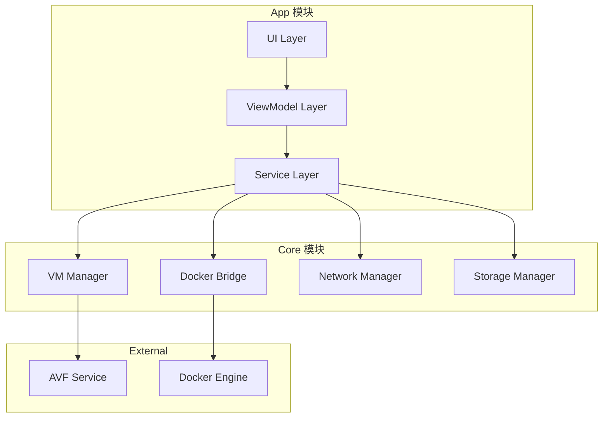
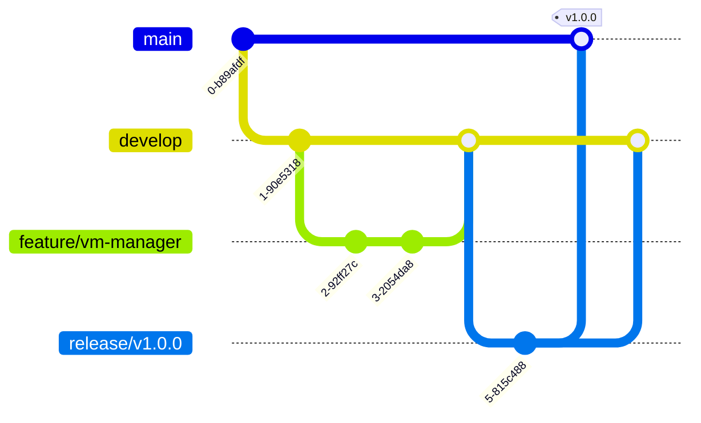

# DFA 开发者指南

本文档面向希望参与 DFA 项目开发的开发者，提供开发环境搭建、代码结构、构建流程等详细信息。

---

## 目录

- [开发环境搭建](#开发环境搭建)
- [代码结构](#代码结构)
- [构建流程](#构建流程)
- [调试方法](#调试方法)
- [测试指南](#测试指南)
- [代码规范](#代码规范)
- [提交规范](#提交规范)

---

## 开发环境搭建

### 系统要求

| 要求 | 说明 |
|------|------|
| 操作系统 | Linux (Ubuntu 20.04+)、macOS 12+、Windows 10+ (WSL2) |
| JDK 版本 | OpenJDK 17 或更高 |
| Android SDK | API 33+ |
| Gradle | 8.0+ (项目包含 wrapper) |
| 内存 | 建议 16GB 以上 |
| 存储空间 | 20GB 以上 |

### 安装依赖

#### 1. 安装 JDK

```bash
# Ubuntu/Debian
sudo apt update
sudo apt install openjdk-17-jdk

# macOS
brew install openjdk@17

# 验证安装
java -version
# 应输出 openjdk version "17.x.x"
```

#### 2. 安装 Android SDK

```bash
# 下载 Android SDK Command-line Tools
# https://developer.android.com/studio#command-tools

# 解压并设置环境变量
mkdir -p ~/android-sdk
unzip commandlinetools-linux-*.zip -d ~/android-sdk

# 设置环境变量
export ANDROID_HOME=~/android-sdk
export PATH=$PATH:$ANDROID_HOME/cmdline-tools/latest/bin
export PATH=$PATH:$ANDROID_HOME/platform-tools
export PATH=$PATH:$ANDROID_HOME/emulator

# 安装必要组件
sdkmanager "platform-tools" "platforms;android-34" "build-tools;34.0.0"
```

#### 3. 克隆仓库

```bash
# 克隆主仓库
git clone https://github.com/your-org/dfa.git
cd dfa

# 克隆子模块（如果有）
git submodule update --init --recursive
```

#### 4. 配置项目

```bash
# 创建 local.properties
echo "sdk.dir=$ANDROID_HOME" > local.properties

# 验证配置
./gradlew tasks
```

### IDE 配置

#### Android Studio

1. 安装 Android Studio (最新版本)
2. 打开项目：`File → Open → 选择 dfa 目录`
3. 等待 Gradle 同步完成
4. 配置代码风格：`Settings → Editor → Code Style → 导入项目配置`

#### VS Code

```bash
# 安装推荐扩展
code --install-extension vscjava.vscode-java-pack
code --install-extension richardwillis.vscode-gradle
code --install-extension ms-azuretools.vscode-docker
```

---

## 代码结构

### 项目目录结构

```
dfa/
├── app/                          # 主应用模块
│   ├── src/
│   │   ├── main/
│   │   │   ├── java/com/dfa/app/
│   │   │   │   ├── ui/           # UI 层
│   │   │   │   ├── viewmodel/    # ViewModel 层
│   │   │   │   ├── service/      # 服务层
│   │   │   │   ├── repository/   # 数据层
│   │   │   │   ├── util/         # 工具类
│   │   │   │   └── App.kt        # 应用入口
│   │   │   ├── res/              # 资源文件
│   │   │   └── AndroidManifest.xml
│   │   ├── test/                 # 单元测试
│   │   └── androidTest/          # 仪器测试
│   └── build.gradle.kts
├── core/                         # 核心模块
│   ├── vm/                       # VM 管理模块
│   ├── docker/                   # Docker 桥接模块
│   ├── network/                  # 网络模块
│   └── storage/                  # 存储模块
├── vm-image/                     # VM 镜像构建
│   ├── rootfs/                   # 根文件系统
│   ├── kernel/                   # 内核配置
│   └── scripts/                  # 构建脚本
├── docs/                         # 文档
├── scripts/                      # 开发脚本
├── build.gradle.kts              # 根构建文件
├── settings.gradle.kts           # 项目设置
└── gradle.properties             # Gradle 配置
```

### 核心模块说明



### 关键类说明

| 类名 | 模块 | 职责 |
|------|------|------|
| `DfaService` | app | 核心服务，协调各模块 |
| `VmManager` | core/vm | 虚拟机生命周期管理 |
| `DockerBridge` | core/docker | Docker API 桥接 |
| `NetworkManager` | core/network | 网络配置管理 |
| `StorageManager` | core/storage | 存储管理 |
| `MainViewModel` | app | 主界面 ViewModel |
| `ContainerRepository` | app | 容器数据仓库 |

---

## 构建流程

### 构建命令

```bash
# 清理构建
./gradlew clean

# 构建 Debug 版本
./gradlew assembleDebug

# 构建 Release 版本
./gradlew assembleRelease

# 构建所有变体
./gradlew assemble

# 运行 lint 检查
./gradlew lint

# 运行所有测试
./gradlew test
```

### 构建变体

| 变体 | 说明 |
|------|------|
| `debug` | 开发调试版本，包含调试信息 |
| `release` | 发布版本，优化性能和大小 |
| `debugMinified` | 混淆的调试版本 |

### 构建输出

```
app/build/outputs/
├── apk/
│   ├── debug/
│   │   └── app-debug.apk
│   └── release/
│       ├── app-release.apk
│       └── app-release-unsigned.apk
├── mapping/
│   └── release/
│       └── mapping.txt
└── logs/
    └── manifest-merger-release-report.txt
```

### 签名配置

```kotlin
// app/build.gradle.kts
android {
    signingConfigs {
        create("release") {
            storeFile = file("release.keystore")
            storePassword = System.getenv("KEYSTORE_PASSWORD")
            keyAlias = "dfa"
            keyPassword = System.getenv("KEY_PASSWORD")
        }
    }
    
    buildTypes {
        release {
            signingConfig = signingConfigs.getByName("release")
        }
    }
}
```

---

## 调试方法

### 日志调试

```kotlin
// 使用 Timber 日志库
import timber.log.Timber

// 调试日志
Timber.d("Debug message: %s", value)

// 信息日志
Timber.i("Info message")

// 警告日志
Timber.w("Warning message")

// 错误日志
Timber.e(exception, "Error message")
```

### 查看 Logcat

```bash
# 过滤 DFA 日志
adb logcat -s DFA:V

# 过滤特定标签
adb logcat -s "DfaService:V" "VmManager:V"

# 保存日志到文件
adb logcat -s DFA:V > dfa_debug.log
```

### 断点调试

1. 在 Android Studio 中设置断点
2. 选择 `Run → Debug 'app'`
3. 应用将在断点处暂停

### 远程调试

```bash
# 启用远程调试
adb shell setprop debug.dfa.enable true

# 连接调试器
adb forward tcp:5005 tcp:5005

# 在 Android Studio 中配置远程调试
# Run → Edit Configurations → Add New → Remote
# Host: localhost, Port: 5005
```

### 性能分析

```bash
# CPU 分析
adb shell am profile start com.dfa.app /data/local/tmp/dfa.prof
# ... 操作应用 ...
adb shell am profile stop com.dfa.app

# 拉取分析文件
adb pull /data/local/tmp/dfa.prof

# 内存分析
adb shell am dumpheap com.dfa.app /data/local/tmp/dfa.hprof
adb pull /data/local/tmp/dfa.hprof
```

---

## 测试指南

### 单元测试

```bash
# 运行所有单元测试
./gradlew test

# 运行特定测试类
./gradlew test --tests "com.dfa.app.service.DfaServiceTest"

# 运行特定测试方法
./gradlew test --tests "com.dfa.app.service.DfaServiceTest.testInitialize"

# 生成测试报告
./gradlew test --info
# 报告位置: app/build/reports/tests/testDebugUnitTest/
```

### 仪器测试

```bash
# 运行仪器测试
./gradlew connectedAndroidTest

# 运行特定测试
adb shell am instrument -w -e class com.dfa.app.DfaTest com.dfa.app.test

# 生成测试报告
# 报告位置: app/build/reports/androidTests/
```

### 测试覆盖率

```bash
# 生成覆盖率报告
./gradlew testDebugUnitTestCoverage

# 报告位置
# app/build/reports/coverage/testDebugUnitTestCoverage/
```

### 测试示例

```kotlin
// 单元测试示例
class VmManagerTest {
    @Test
    fun `createVm should return valid instance`() {
        val vmManager = VmManager(mockContext)
        val config = VmConfig(memory = 2048, cpus = 2)
        
        val result = vmManager.createVm(config)
        
        assertNotNull(result)
        assertEquals(2048, result.memory)
        assertEquals(2, result.cpus)
    }
    
    @Test
    fun `startVm should throw exception when config invalid`() {
        val vmManager = VmManager(mockContext)
        val config = VmConfig(memory = 0, cpus = 0)
        
        assertThrows<IllegalArgumentException> {
            vmManager.createVm(config)
        }
    }
}
```

```kotlin
// 仪器测试示例
@RunWith(AndroidJUnit4::class)
class DfaServiceTest {
    @get:Rule
    val instantTaskExecutorRule = InstantTaskExecutorRule()
    
    private lateinit var dfaService: DfaService
    
    @Before
    fun setup() {
        val context = ApplicationProvider.getApplicationContext<Context>()
        dfaService = DfaService(context)
    }
    
    @Test
    fun testInitialize() = runTest {
        dfaService.initialize()
        assertTrue(dfaService.isInitialized)
    }
}
```

---

## 代码规范

### Kotlin 代码风格

```kotlin
// 类定义
class VmManager(
    private val context: Context,
    private val config: VmConfig
) {
    // 属性
    private val _vmState = MutableStateFlow<VmState>(VmState.Idle)
    val vmState: StateFlow<VmState> = _vmState.asStateFlow()
    
    // 公共方法
    fun createVm(config: VmConfig): Result<VmInstance> {
        return try {
            val instance = doCreateVm(config)
            Result.success(instance)
        } catch (e: Exception) {
            Result.failure(e)
        }
    }
    
    // 私有方法
    private fun doCreateVm(config: VmConfig): VmInstance {
        // 实现
    }
}

// 数据类
data class VmConfig(
    val memory: Int = 2048,
    val cpus: Int = 2,
    val storage: Int = 10
)

// 密封类
sealed class VmState {
    object Idle : VmState()
    object Starting : VmState()
    object Running : VmState()
    object Stopping : VmState()
    data class Error(val message: String) : VmState()
}
```

### 命名规范

| 类型 | 规范 | 示例 |
|------|------|------|
| 类 | PascalCase | `VmManager` |
| 函数 | camelCase | `createVm()` |
| 变量 | camelCase | `vmInstance` |
| 常量 | UPPER_SNAKE_CASE | `MAX_MEMORY_SIZE` |
| 资源 ID | snake_case | `@id/vm_status_text` |

### 注释规范

```kotlin
/**
 * 虚拟机管理器，负责 VM 的创建、启动、停止和销毁。
 *
 * 使用示例：
 * ```kotlin
 * val manager = VmManager(context, config)
 * manager.createVm(config)
 * manager.startVm()
 * ```
 *
 * @property context Android 上下文
 * @property config VM 配置
 */
class VmManager(
    private val context: Context,
    private val config: VmConfig
) {
    /**
     * 创建新的虚拟机实例。
     *
     * @param config VM 配置参数
     * @return 创建结果，成功返回 VmInstance，失败返回异常
     */
    fun createVm(config: VmConfig): Result<VmInstance> {
        // ...
    }
}
```

---

## 提交规范

### Git 分支策略



### 分支命名

| 类型 | 格式 | 示例 |
|------|------|------|
| 功能 | `feature/描述` | `feature/vm-manager` |
| 修复 | `fix/描述` | `fix/memory-leak` |
| 发布 | `release/版本号` | `release/v1.0.0` |
| 热修复 | `hotfix/描述` | `hotfix/crash-fix` |

### 提交信息格式

```
<type>(<scope>): <subject>

<body>

<footer>
```

#### Type 类型

| 类型 | 说明 |
|------|------|
| `feat` | 新功能 |
| `fix` | Bug 修复 |
| `docs` | 文档更新 |
| `style` | 代码格式（不影响功能） |
| `refactor` | 重构 |
| `test` | 测试相关 |
| `chore` | 构建/工具相关 |

#### 示例

```
feat(vm): add VM snapshot support

- Add snapshot creation API
- Add snapshot restoration API
- Add snapshot deletion API

Closes #123
```

---

## 相关文档

- [架构文档](ARCHITECTURE.md)
- [安装指南](INSTALLATION.md)
- [贡献指南](../CONTRIBUTING.md)
- [API 参考](API-REFERENCE.md)