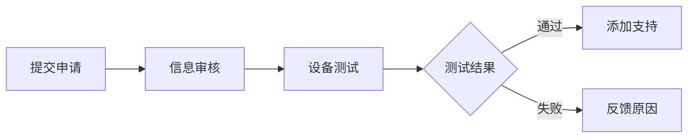

# 设备支持列表

本文档列出 DFA 支持的设备和兼容性状态。

---

## 目录

- [设备要求](#设备要求)
- [支持设备列表](#支持设备列表)
- [兼容性状态说明](#兼容性状态说明)
- [设备测试方法](#设备测试方法)
- [不支持的设备](#不支持的设备)
- [设备支持申请](#设备支持申请)

---

## 设备要求

### 最低要求

| 要求 | 说明 |
|------|------|
| Android 版本 | Android 13 (API 33) 或更高 |
| CPU 架构 | ARM64 (aarch64) |
| 内存 | 4GB RAM（推荐 6GB+） |
| 存储 | 2GB 可用空间（推荐 4GB+） |
| KVM 支持 | 必须支持 KVM 虚拟化 |

### 检查设备兼容性

```bash
# 检查 Android 版本
adb shell getprop ro.build.version.sdk
# 输出应 >= 33

# 检查 CPU 架构
adb shell getprop ro.product.cpu.abi
# 输出应为 arm64-v8a

# 检查 KVM 支持
adb shell ls -la /dev/kvm
# 应显示 kvm 设备

# 检查内存
adb shell cat /proc/meminfo | grep MemTotal
# 应 >= 4GB
```

---

## 支持设备列表

### Google Pixel 系列

| 设备型号 | Android 版本 | 状态 | 备注 |
|----------|--------------|------|------|
| Pixel 7 | 13+ | ✅ 完全支持 | 推荐设备 |
| Pixel 7 Pro | 13+ | ✅ 完全支持 | 推荐设备 |
| Pixel 7a | 13+ | ✅ 完全支持 | |
| Pixel 8 | 14+ | ✅ 完全支持 | 推荐设备 |
| Pixel 8 Pro | 14+ | ✅ 完全支持 | 推荐设备 |
| Pixel 8a | 14+ | ✅ 完全支持 | |
| Pixel Fold | 13+ | ✅ 完全支持 | |
| Pixel Tablet | 13+ | ✅ 完全支持 | |

### Samsung Galaxy 系列

| 设备型号 | Android 版本 | 状态 | 备注 |
|----------|--------------|------|------|
| Galaxy S23 | 13+ | ✅ 完全支持 | 推荐设备 |
| Galaxy S23+ | 13+ | ✅ 完全支持 | |
| Galaxy S23 Ultra | 13+ | ✅ 完全支持 | 推荐设备 |
| Galaxy S24 | 14+ | ✅ 完全支持 | 推荐设备 |
| Galaxy S24+ | 14+ | ✅ 完全支持 | |
| Galaxy S24 Ultra | 14+ | ✅ 完全支持 | 推荐设备 |
| Galaxy Z Fold 5 | 13+ | ✅ 完全支持 | |
| Galaxy Z Fold 6 | 14+ | ✅ 完全支持 | |
| Galaxy Z Flip 5 | 13+ | ✅ 完全支持 | |
| Galaxy Z Flip 6 | 14+ | ✅ 完全支持 | |
| Galaxy Tab S9 | 13+ | ✅ 完全支持 | |
| Galaxy Tab S9+ | 13+ | ✅ 完全支持 | |

### OnePlus 系列

| 设备型号 | Android 版本 | 状态 | 备注 |
|----------|--------------|------|------|
| OnePlus 11 | 13+ | ⚠️ 部分支持 | 需要解锁 Bootloader |
| OnePlus 11 Pro | 13+ | ⚠️ 部分支持 | 需要解锁 Bootloader |
| OnePlus 12 | 14+ | ⚠️ 部分支持 | 需要解锁 Bootloader |
| OnePlus Open | 13+ | ⚠️ 部分支持 | 需要解锁 Bootloader |

### Xiaomi 系列

| 设备型号 | Android 版本 | 状态 | 备注 |
|----------|--------------|------|------|
| Xiaomi 13 | 13+ | ⚠️ 部分支持 | 需要 MIUI 解锁 |
| Xiaomi 13 Pro | 13+ | ⚠️ 部分支持 | 需要 MIUI 解锁 |
| Xiaomi 13 Ultra | 13+ | ⚠️ 部分支持 | 需要 MIUI 解锁 |
| Xiaomi 14 | 14+ | ⚠️ 部分支持 | 需要 MIUI 解锁 |
| Xiaomi 14 Pro | 14+ | ⚠️ 部分支持 | 需要 MIUI 解锁 |

### OPPO / Realme 系列

| 设备型号 | Android 版本 | 状态 | 备注 |
|----------|--------------|------|------|
| OPPO Find X6 Pro | 13+ | ⚠️ 部分支持 | 需要解锁 |
| OPPO Find X7 Ultra | 14+ | ⚠️ 部分支持 | 需要解锁 |
| Realme GT3 | 13+ | ⚠️ 部分支持 | 需要解锁 |

### Vivo 系列

| 设备型号 | Android 版本 | 状态 | 备注 |
|----------|--------------|------|------|
| Vivo X90 Pro+ | 13+ | ⚠️ 部分支持 | 需要解锁 |
| Vivo X100 Pro | 14+ | ⚠️ 部分支持 | 需要解锁 |

### Motorola 系列

| 设备型号 | Android 版本 | 状态 | 备注 |
|----------|--------------|------|------|
| Motorola Edge 40 Pro | 13+ | ⚠️ 部分支持 | |
| Motorola Edge 50 Ultra | 14+ | ⚠️ 部分支持 | |

---

## 兼容性状态说明

### 状态图标

| 状态 | 图标 | 说明 |
|------|------|------|
| 完全支持 | ✅ | 所有功能正常工作 |
| 部分支持 | ⚠️ | 部分功能受限或需要额外配置 |
| 不支持 | ❌ | 设备不满足最低要求 |

### 完全支持标准

设备需要满足以下条件才能标记为"完全支持"：

- [ ] Android 13+ 系统
- [ ] KVM 设备可用
- [ ] VM 正常启动
- [ ] Docker 正常运行
- [ ] 容器创建和运行正常
- [ ] 网络功能正常
- [ ] 存储功能正常
- [ ] 经过完整测试验证

### 部分支持说明

"部分支持"通常意味着：

1. **需要解锁 Bootloader**
   - 部分厂商需要解锁 Bootloader 才能访问 KVM
   - 解锁可能导致保修失效

2. **需要额外配置**
   - 可能需要修改系统设置
   - 可能需要安装额外组件

3. **功能受限**
   - 某些功能可能不可用
   - 性能可能不如完全支持的设备

---

## 设备测试方法

### 自动测试脚本

```bash
#!/bin/bash
# dfa-device-test.sh - 设备兼容性测试脚本

echo "=== DFA 设备兼容性测试 ==="
echo ""

# 测试结果
PASS=0
FAIL=0

# 测试 1: Android 版本
echo "测试 1: Android 版本..."
SDK=$(adb shell getprop ro.build.version.sdk)
if [ "$SDK" -ge 33 ]; then
    echo "  ✅ 通过 (SDK: $SDK)"
    ((PASS++))
else
    echo "  ❌ 失败 (SDK: $SDK, 需要 >= 33)"
    ((FAIL++))
fi

# 测试 2: CPU 架构
echo "测试 2: CPU 架构..."
ABI=$(adb shell getprop ro.product.cpu.abi)
if [ "$ABI" = "arm64-v8a" ]; then
    echo "  ✅ 通过 ($ABI)"
    ((PASS++))
else
    echo "  ❌ 失败 ($ABI, 需要 arm64-v8a)"
    ((FAIL++))
fi

# 测试 3: KVM 支持
echo "测试 3: KVM 支持..."
if adb shell ls /dev/kvm &>/dev/null; then
    echo "  ✅ 通过 (KVM 可用)"
    ((PASS++))
else
    echo "  ❌ 失败 (KVM 不可用)"
    ((FAIL++))
fi

# 测试 4: 内存
echo "测试 4: 内存..."
MEM=$(adb shell cat /proc/meminfo | grep MemTotal | awk '{print $2}')
MEM_MB=$((MEM / 1024))
if [ "$MEM_MB" -ge 4000 ]; then
    echo "  ✅ 通过 (${MEM_MB}MB)"
    ((PASS++))
else
    echo "  ⚠️ 警告 (${MEM_MB}MB, 推荐 >= 4000MB)"
fi

# 测试 5: 存储空间
echo "测试 5: 存储空间..."
STORAGE=$(adb shell df /data | tail -1 | awk '{print $4}')
STORAGE_GB=$((STORAGE / 1024 / 1024))
if [ "$STORAGE_GB" -ge 2 ]; then
    echo "  ✅ 通过 (${STORAGE_GB}GB 可用)"
    ((PASS++))
else
    echo "  ❌ 失败 (${STORAGE_GB}GB 可用, 需要 >= 2GB)"
    ((FAIL++))
fi

echo ""
echo "=== 测试结果 ==="
echo "通过: $PASS"
echo "失败: $FAIL"
echo ""

if [ "$FAIL" -eq 0 ]; then
    echo "✅ 设备兼容 DFA"
    exit 0
else
    echo "❌ 设备不兼容 DFA"
    exit 1
fi
```

### 手动测试步骤

1. **检查系统信息**
   ```bash
   adb shell getprop
   ```

2. **检查 KVM**
   ```bash
   adb shell ls -la /dev/kvm
   adb shell cat /proc/cpuinfo | grep -i "features"
   ```

3. **安装 DFA**
   ```bash
   adb install dfa.apk
   ```

4. **启动并测试**
   ```bash
   # 启动应用
   adb shell am start -n com.dfa.app/.MainActivity
   
   # 等待初始化
   sleep 30
   
   # 测试 Docker
   dfa docker run --rm hello-world
   ```

---

## 不支持的设备

### 不支持原因

| 原因 | 说明 |
|------|------|
| Android 版本过低 | Android 12 及以下不支持 AVF |
| CPU 架构不支持 | 非 ARM64 架构不支持 |
| KVM 不可用 | 设备不支持硬件虚拟化 |
| 内存不足 | 内存小于 4GB |

### 常见不支持设备

| 设备类型 | 原因 |
|----------|------|
| 32 位设备 | CPU 架构不支持 |
| Android 12 及以下 | 系统版本不支持 |
| 低端设备 | 内存/存储不足 |
| 部分华为设备 | KVM 不可用 |

---

## 设备支持申请

### 申请流程



### 申请模板

```markdown
## 设备信息
- 设备品牌：
- 设备型号：
- Android 版本：
- 系统版本：

## 设备规格
- CPU：
- 内存：
- 存储：

## 测试结果
```
[粘贴测试脚本输出]
```

## 问题描述
[描述遇到的问题]

## 联系方式
[您的联系方式]
```

### 提交方式

- GitHub Issue: https://github.com/your-org/dfa/issues
- 邮件: device-support@dfa-project.org

---

## 相关文档

- [安装指南](INSTALLATION.md)
- [故障排除](TROUBLESHOOTING.md)
- [FAQ](FAQ.md)