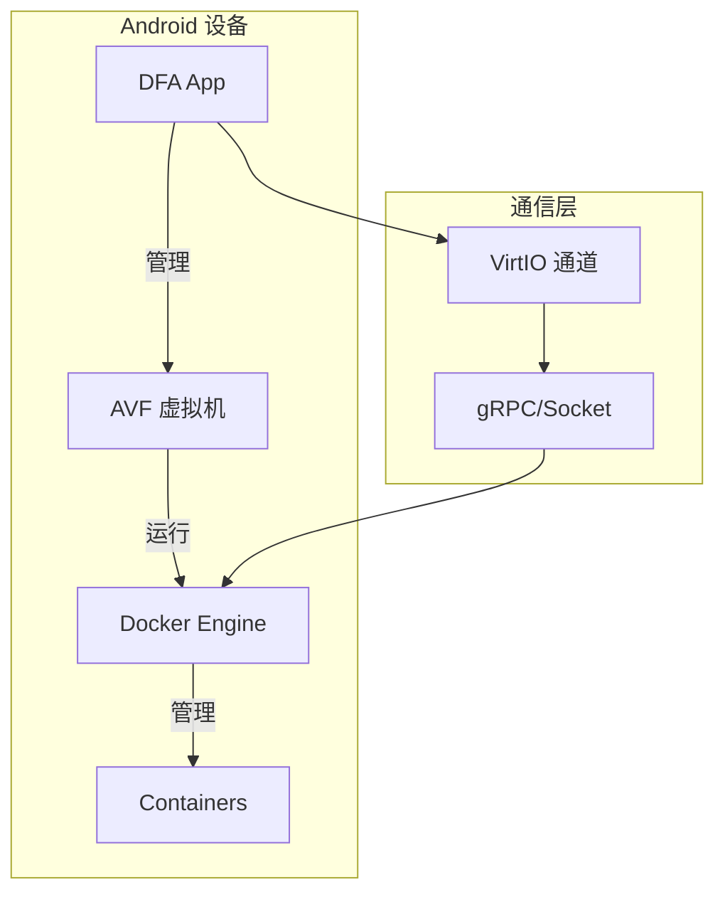
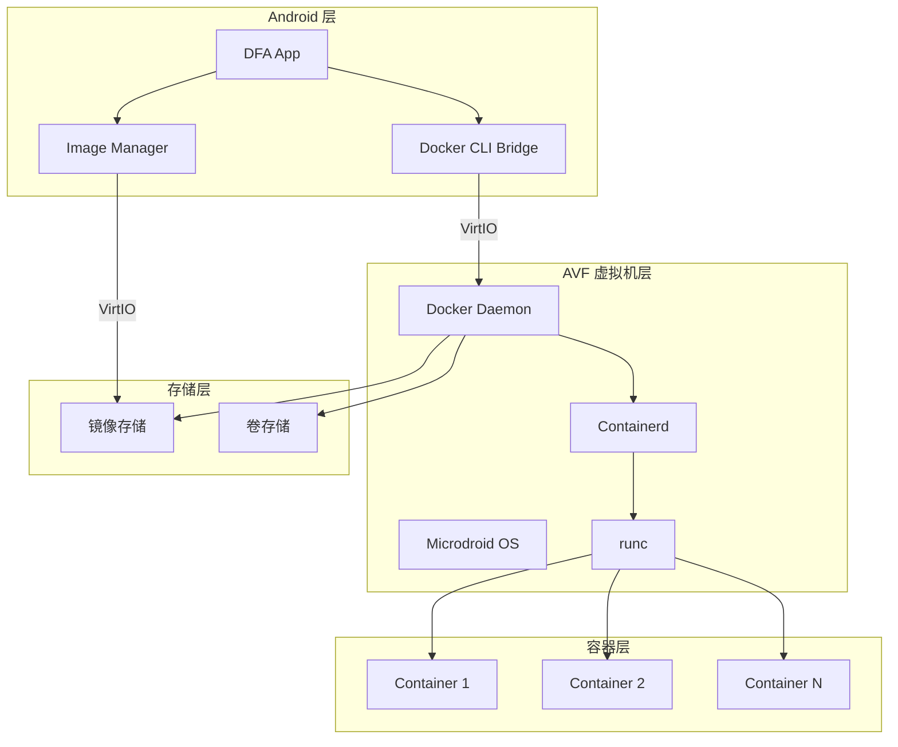
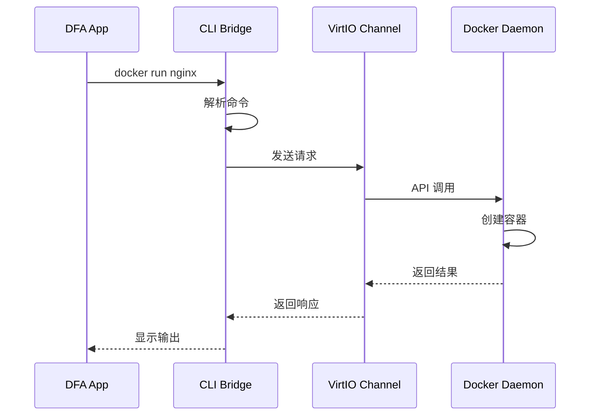
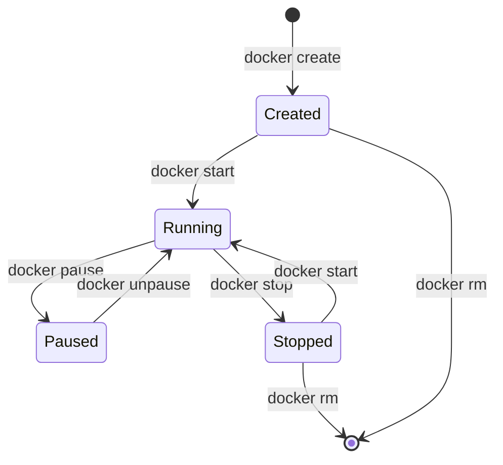
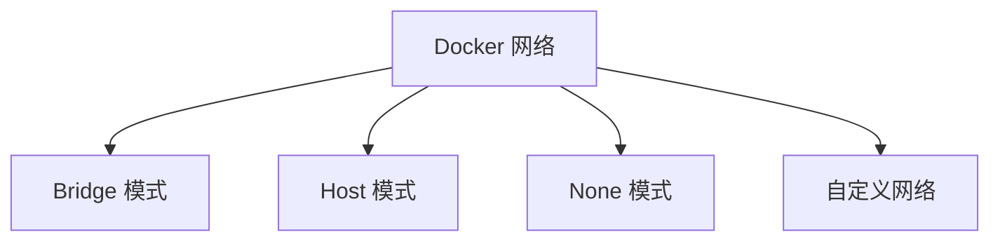
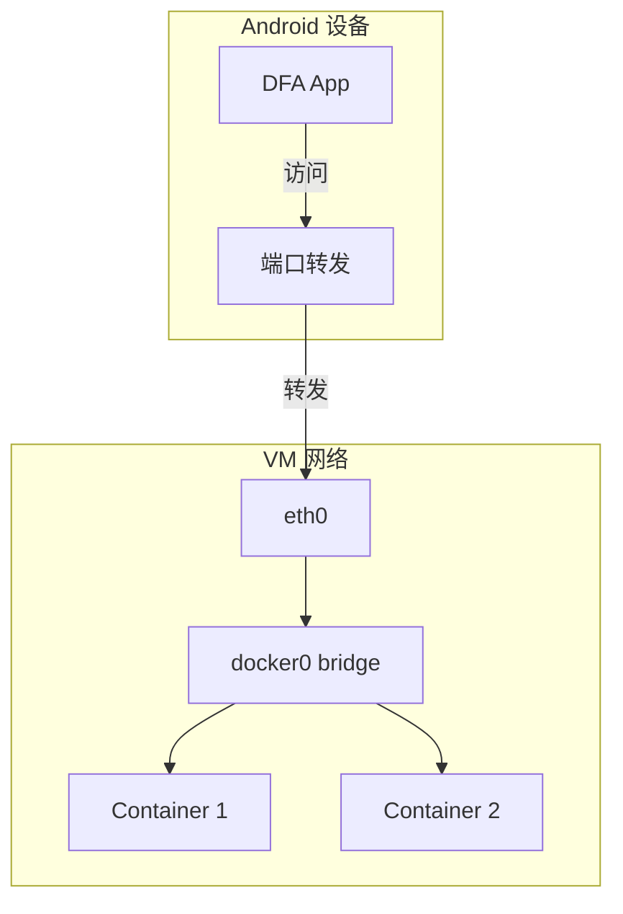
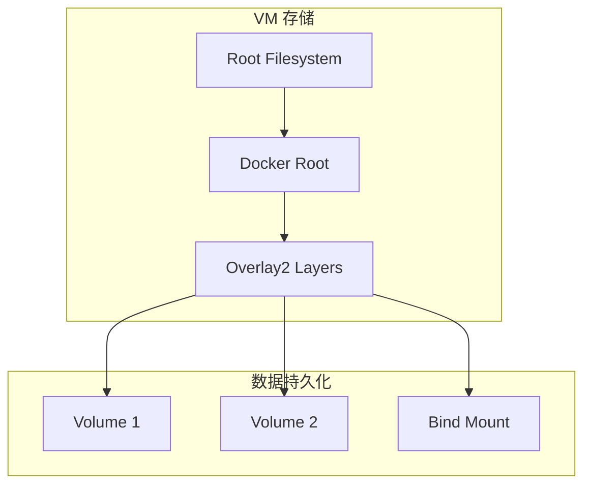

# Docker 集成指南

本文档详细说明 DFA 如何在 AVF 虚拟机中集成 Docker，以及相关的配置和使用方法。

---

## 目录

- [概述](#概述)
- [Docker on AVF 架构](#docker-on-avf-架构)
- [内核配置要求](#内核配置要求)
- [Docker 安装](#docker-安装)
- [容器管理](#容器管理)
- [网络配置](#网络配置)
- [存储配置](#存储配置)
- [性能优化](#性能优化)

---

## 概述

DFA 通过在 AVF 虚拟机中运行完整的 Docker 引擎，实现 Android 设备上的原生 Docker 支持。



### 核心优势

| 优势 | 说明 |
|------|------|
| 原生兼容 | 支持标准 Docker 镜像和命令 |
| 安全隔离 | 容器运行在隔离的虚拟机中 |
| 资源控制 | 精确的资源分配和限制 |
| 网络灵活 | 支持多种网络模式 |
| 持久化存储 | 支持数据卷和持久化 |

---

## Docker on AVF 架构

### 整体架构



### 组件说明

| 组件 | 位置 | 职责 |
|------|------|------|
| DFA App | Android | 用户界面和核心逻辑 |
| Docker CLI Bridge | Android | Docker 命令桥接 |
| Image Manager | Android | 镜像管理 |
| Microdroid OS | VM | 轻量级 Linux 系统 |
| Docker Daemon | VM | Docker 主进程 |
| Containerd | VM | 容器运行时 |
| runc | VM | OCI 运行时 |

### 通信机制



---

## 内核配置要求

### 必需的内核特性

```bash
# Docker 运行所需的内核配置
CONFIG_NAMESPACES=y
CONFIG_NET_NS=y
CONFIG_PID_NS=y
CONFIG_IPC_NS=y
CONFIG_UTS_NS=y
CONFIG_CGROUPS=y
CONFIG_CGROUP_CPUACCT=y
CONFIG_CGROUP_DEVICE=y
CONFIG_CGROUP_FREEZER=y
CONFIG_CGROUP_SCHED=y
CONFIG_CPUSETS=y
CONFIG_MEMCG=y
CONFIG_KEYS=y
CONFIG_VETH=y
CONFIG_BRIDGE=y
CONFIG_BRIDGE_NETFILTER=y
CONFIG_NF_NAT_IPV4=y
CONFIG_IP_NF_FILTER=y
CONFIG_IP_NF_TARGET_MASQUERADE=y
CONFIG_NETFILTER_XT_MATCH_ADDRTYPE=y
CONFIG_NETFILTER_XT_MATCH_CONNTRACK=y
CONFIG_NETFILTER_XT_MATCH_IPVS=y
CONFIG_IP_NF_NAT=y
CONFIG_NF_NAT=y
CONFIG_NF_NAT_NEEDED=y
CONFIG_POSIX_MQUEUE=y
```

### 存储驱动配置

```bash
# OverlayFS (推荐)
CONFIG_OVERLAY_FS=y

# 或 Device Mapper
CONFIG_BLK_DEV_DM=y
CONFIG_DM_THIN_PROVISIONING=y

# 或 Btrfs
CONFIG_BTRFS_FS=y
```

### 网络配置

```bash
# 网络相关配置
CONFIG_NET=y
CONFIG_INET=y
CONFIG_NETFILTER=y
CONFIG_NF_CONNTRACK=y
CONFIG_NF_CONNTRACK_IPV4=y
CONFIG_NF_NAT_IPV4=y
CONFIG_BRIDGE_NETFILTER=y
CONFIG_IP_NF_IPTABLES=y
CONFIG_IP_NF_FILTER=y
CONFIG_IP_NF_NAT=y
CONFIG_IP_NF_TARGET_MASQUERADE=y
```

### 验证内核配置

```bash
# 在 VM 中检查内核配置
zcat /proc/config.gz | grep -E "CONFIG_(NAMESPACES|CGROUPS|OVERLAY_FS)="

# 检查必需的内核模块
lsmod | grep -E "overlay|bridge|nf_nat"
```

---

## Docker 安装

### VM 镜像构建

```dockerfile
# Dockerfile for Microdroid with Docker
FROM microdroid:latest

# 安装依赖
RUN apt-get update && apt-get install -y \
    ca-certificates \
    curl \
    gnupg \
    lsb-release

# 添加 Docker 官方 GPG 密钥
RUN curl -fsSL https://download.docker.com/linux/debian/gpg | gpg --dearmor -o /usr/share/keyrings/docker-archive-keyring.gpg

# 添加 Docker 仓库
RUN echo "deb [arch=$(dpkg --print-architecture) signed-by=/usr/share/keyrings/docker-archive-keyring.gpg] https://download.docker.com/linux/debian $(lsb_release -cs) stable" | tee /etc/apt/sources.list.d/docker.list > /dev/null

# 安装 Docker
RUN apt-get update && apt-get install -y docker-ce docker-ce-cli containerd.io

# 配置 Docker
COPY daemon.json /etc/docker/daemon.json

# 启动脚本
COPY start-docker.sh /start-docker.sh
RUN chmod +x /start-docker.sh

CMD ["/start-docker.sh"]
```

### Docker 配置文件

```json
// /etc/docker/daemon.json
{
  "storage-driver": "overlay2",
  "log-driver": "json-file",
  "log-opts": {
    "max-size": "10m",
    "max-file": "3"
  },
  "default-ulimits": {
    "nofile": {
      "Name": "nofile",
      "Hard": 65536,
      "Soft": 65536
    }
  },
  "live-restore": true,
  "userland-proxy": false,
  "bip": "172.17.0.1/16",
  "default-address-pools": [
    {
      "base": "172.17.0.0/16",
      "size": 24
    }
  ]
}
```

### 启动脚本

```bash
#!/bin/bash
# start-docker.sh

# 启动 containerd
containerd &

# 等待 containerd 就绪
sleep 2

# 启动 Docker Daemon
dockerd --config-file=/etc/docker/daemon.json &

# 等待 Docker 就绪
while ! docker info > /dev/null 2>&1; do
    sleep 1
done

echo "Docker is ready"

# 保持容器运行
tail -f /dev/null
```

---

## 容器管理

### 基本操作

```bash
# 列出容器
dfa docker ps -a

# 创建容器
dfa docker create --name myapp nginx:latest

# 启动容器
dfa docker start myapp

# 停止容器
dfa docker stop myapp

# 删除容器
dfa docker rm myapp

# 查看日志
dfa docker logs myapp

# 进入容器
dfa docker exec -it myapp /bin/bash
```

### 容器资源限制

```bash
# 内存限制
dfa docker run -d --memory="512m" --memory-swap="1g" nginx

# CPU 限制
dfa docker run -d --cpus="1.5" --cpu-shares=512 nginx

# 存储限制
dfa docker run -d --storage-opt size=10g nginx

# 综合限制
dfa docker run -d \
    --name limited-container \
    --memory="256m" \
    --cpus="0.5" \
    --pids-limit=100 \
    nginx
```

### 容器生命周期管理



---

## 网络配置

### 网络模式



### Bridge 网络

```bash
# 创建自定义 bridge 网络
dfa docker network create --driver bridge mynet

# 使用自定义网络运行容器
dfa docker run -d --network mynet --name web nginx

# 连接容器到网络
dfa docker network connect mynet existing-container
```

### 端口映射

```bash
# 映射单个端口
dfa docker run -d -p 8080:80 nginx

# 映射多个端口
dfa docker run -d -p 8080:80 -p 8443:443 nginx

# 指定 IP 映射
dfa docker run -d -p 127.0.0.1:8080:80 nginx

# 映射 UDP 端口
dfa docker run -d -p 53:53/udp dns-server
```

### 网络架构



### DNS 配置

```bash
# 自定义 DNS 服务器
dfa docker run -d --dns 8.8.8.8 --dns 8.8.4.4 nginx

# 自定义 DNS 搜索域
dfa docker run -d --dns-search example.com nginx

# 添加 hosts 条目
dfa docker run -d --add-host myhost:192.168.1.100 nginx
```

---

## 存储配置

### 存储驱动

| 驱动 | 说明 | 推荐场景 |
|------|------|----------|
| overlay2 | 联合文件系统 | 默认推荐 |
| devicemapper | 块设备映射 | 生产环境 |
| btrfs | Btrfs 文件系统 | 需要快照功能 |
| vfs | 虚拟文件系统 | 不支持其他驱动时 |

### 数据卷

```bash
# 创建数据卷
dfa docker volume create mydata

# 使用数据卷
dfa docker run -d -v mydata:/data nginx

# 挂载主机目录
dfa docker run -d -v /host/path:/container/path nginx

# 只读挂载
dfa docker run -d -v mydata:/data:ro nginx

# 列出数据卷
dfa docker volume ls

# 删除数据卷
dfa docker volume rm mydata
```

### 存储架构



---

## 性能优化

### 存储优化

```json
// daemon.json 存储优化配置
{
  "storage-driver": "overlay2",
  "storage-opts": [
    "overlay2.size=20G",
    "overlay2.override_kernel_check=true"
  ]
}
```

### 网络优化

```json
// daemon.json 网络优化配置
{
  "max-concurrent-downloads": 10,
  "max-concurrent-uploads": 5,
  "default-address-pools": [
    {
      "base": "172.17.0.0/16",
      "size": 24
    }
  ]
}
```

### 日志优化

```json
// daemon.json 日志优化配置
{
  "log-driver": "json-file",
  "log-opts": {
    "max-size": "10m",
    "max-file": "3",
    "compress": "true"
  }
}
```

### 资源监控

```bash
# 查看容器资源使用
dfa docker stats

# 查看容器详细信息
dfa docker inspect container-name

# 查看系统信息
dfa docker system df

# 清理未使用资源
dfa docker system prune -a
```

---

## 相关文档

- [架构文档](ARCHITECTURE.md)
- [AVF 指南](AVF-GUIDE.md)
- [安装指南](INSTALLATION.md)
- [故障排除](TROUBLESHOOTING.md)