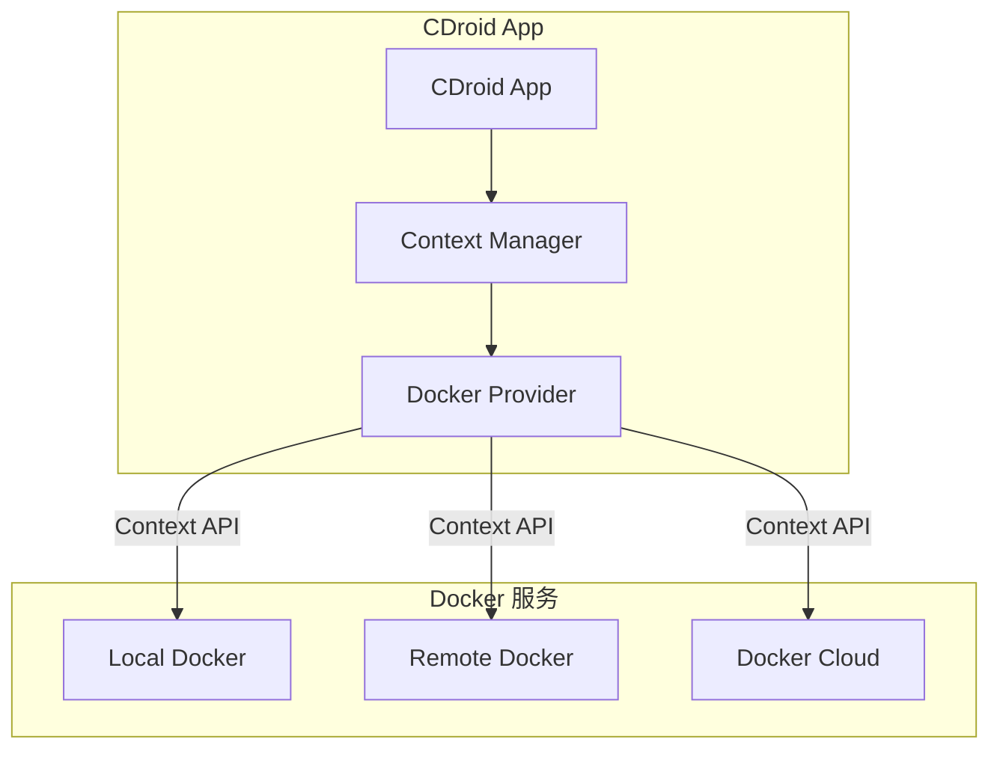
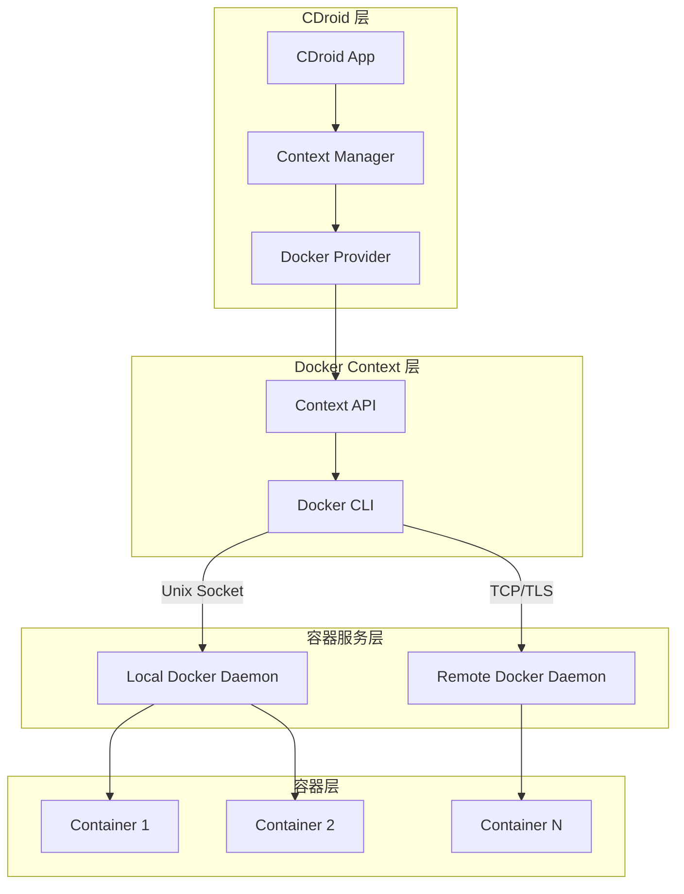
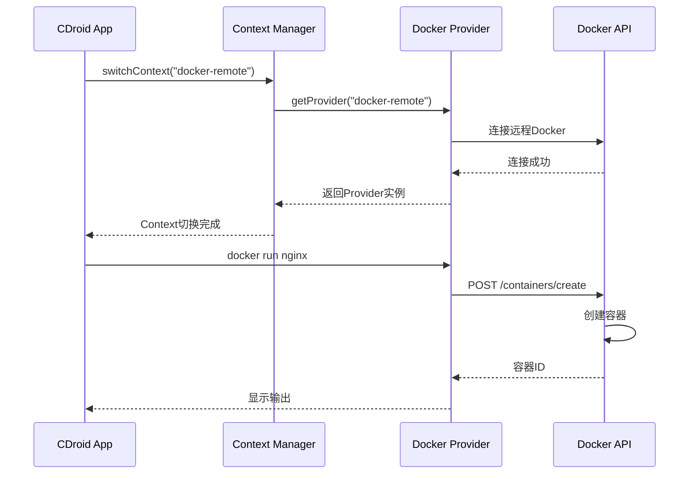
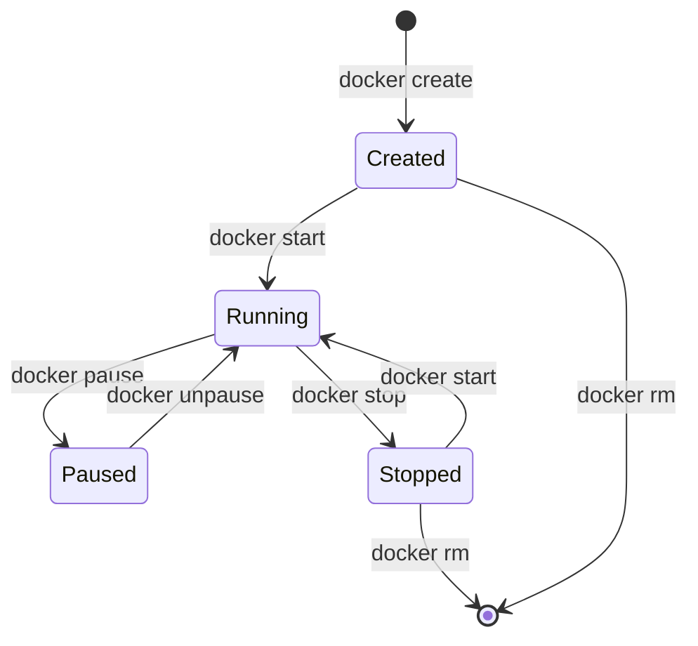
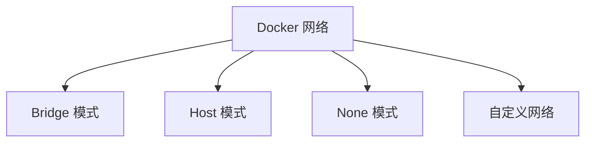
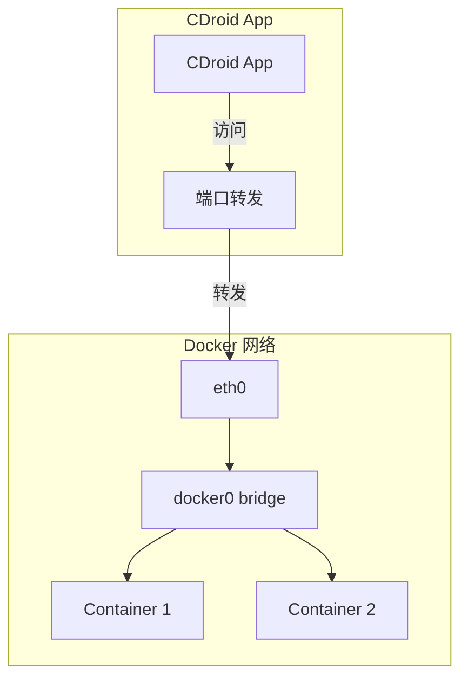
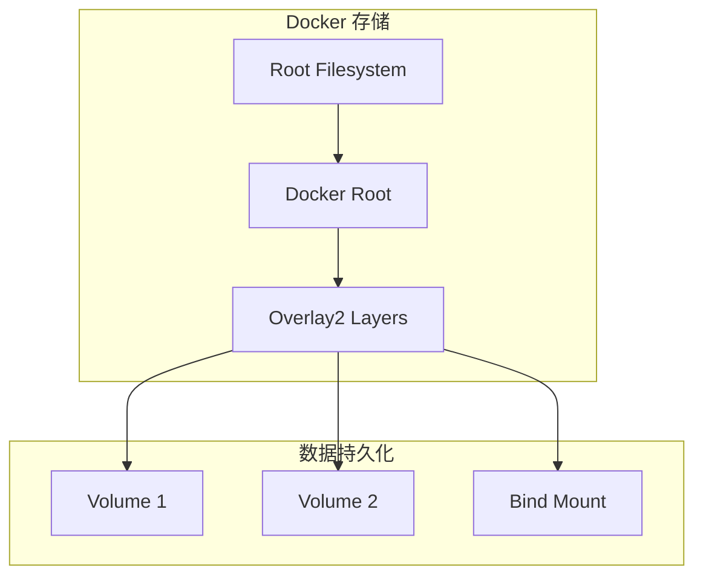

# Docker 集成指南

本文档详细说明 CDroid 如何通过 Docker Context API 连接和管理 Docker 服务。

---

## 目录

- [概述](#概述)
- [Docker Context 架构](#docker-context-架构)
- [Context 配置](#context-配置)
- [容器管理](#容器管理)
- [网络配置](#网络配置)
- [存储配置](#存储配置)
- [性能优化](#性能优化)

---

## 概述

CDroid 通过 Docker Context API 连接和管理 Docker 服务，支持本地和远程 Docker 服务。



### 核心优势

| 优势 | 说明 |
|------|------|
| 远程管理 | 支持连接远程Docker服务 |
| 多Context | 支持管理多个Docker Context |
| 标准API | 使用标准Docker API |
| 安全连接 | 支持TLS加密连接 |
| 跨平台 | 支持多种平台 |

---

## Docker Context 架构

### 整体架构



### 组件说明

| 组件 | 位置 | 职责 |
|------|------|------|
| CDroid App | Android | 用户界面和核心逻辑 |
| Context Manager | Android | Context管理 |
| Docker Provider | Android | Docker API封装 |
| Context API | Docker CLI | Context管理API |
| Docker Daemon | 服务端 | Docker主进程 |

### 通信机制



---

## Context 配置

### 创建 Context

```bash
# 创建本地 Context
cdroid context create local --docker "unix:///var/run/docker.sock"

# 创建远程 Context
cdroid context create remote --docker "tcp://192.168.1.100:2376" --tls

# 创建云端 Context
cdroid context create cloud --docker "tcp://cloud.docker.com:2376" --tls
```

### Context 配置文件

```yaml
# ~/.cdroid/contexts.yaml
contexts:
  local:
    name: local
    type: docker
    endpoint: unix:///var/run/docker.sock
    tls: false
  
  remote:
    name: remote
    type: docker
    endpoint: tcp://192.168.1.100:2376
    tls:
      cert: /path/to/cert.pem
      key: /path/to/key.pem
      ca: /path/to/ca.pem
  
  cloud:
    name: cloud
    type: docker
    endpoint: tcp://cloud.docker.com:2376
    tls: true
```

### 切换 Context

```bash
# 列出所有 Context
cdroid context ls

# 切换 Context
cdroid context use remote

# 查看当前 Context
cdroid context current

# 删除 Context
cdroid context rm remote
```

---

## 容器管理

### 基本操作

```bash
# 列出容器
cdroid docker ps -a

# 创建容器
cdroid docker create --name myapp nginx:latest

# 启动容器
cdroid docker start myapp

# 停止容器
cdroid docker stop myapp

# 删除容器
cdroid docker rm myapp

# 查看日志
cdroid docker logs myapp

# 进入容器
cdroid docker exec -it myapp /bin/bash
```

### 容器资源限制

```bash
# 内存限制
cdroid docker run -d --memory="512m" --memory-swap="1g" nginx

# CPU 限制
cdroid docker run -d --cpus="1.5" --cpu-shares=512 nginx

# 存储限制
cdroid docker run -d --storage-opt size=10g nginx

# 综合限制
cdroid docker run -d \
    --name limited-container \
    --memory="256m" \
    --cpus="0.5" \
    --pids-limit=100 \
    nginx
```

### 容器生命周期管理



---

## 网络配置

### 网络模式



### Bridge 网络

```bash
# 创建自定义 bridge 网络
cdroid docker network create --driver bridge mynet

# 使用自定义网络运行容器
cdroid docker run -d --network mynet --name web nginx

# 连接容器到网络
cdroid docker network connect mynet existing-container
```

### 端口映射

```bash
# 映射单个端口
cdroid docker run -d -p 8080:80 nginx

# 映射多个端口
cdroid docker run -d -p 8080:80 -p 8443:443 nginx

# 指定 IP 映射
cdroid docker run -d -p 127.0.0.1:8080:80 nginx

# 映射 UDP 端口
cdroid docker run -d -p 53:53/udp dns-server
```

### 网络架构



### DNS 配置

```bash
# 自定义 DNS 服务器
cdroid docker run -d --dns 8.8.8.8 --dns 8.8.4.4 nginx

# 自定义 DNS 搜索域
cdroid docker run -d --dns-search example.com nginx

# 添加 hosts 条目
cdroid docker run -d --add-host myhost:192.168.1.100 nginx
```

---

## 存储配置

### 存储驱动

| 驱动 | 说明 | 推荐场景 |
|------|------|----------|
| overlay2 | 联合文件系统 | 默认推荐 |
| devicemapper | 块设备映射 | 生产环境 |
| btrfs | Btrfs 文件系统 | 需要快照功能 |
| vfs | 虚拟文件系统 | 不支持其他驱动时 |

### 数据卷

```bash
# 创建数据卷
cdroid docker volume create mydata

# 使用数据卷
cdroid docker run -d -v mydata:/data nginx

# 挂载主机目录
cdroid docker run -d -v /host/path:/container/path nginx

# 只读挂载
cdroid docker run -d -v mydata:/data:ro nginx

# 列出数据卷
cdroid docker volume ls

# 删除数据卷
cdroid docker volume rm mydata
```

### 存储架构



---

## 性能优化

### 存储优化

```json
// daemon.json 存储优化配置
{
  "storage-driver": "overlay2",
  "storage-opts": [
    "overlay2.size=20G",
    "overlay2.override_kernel_check=true"
  ]
}
```

### 网络优化

```json
// daemon.json 网络优化配置
{
  "max-concurrent-downloads": 10,
  "max-concurrent-uploads": 5,
  "default-address-pools": [
    {
      "base": "172.17.0.0/16",
      "size": 24
    }
  ]
}
```

### 日志优化

```json
// daemon.json 日志优化配置
{
  "log-driver": "json-file",
  "log-opts": {
    "max-size": "10m",
    "max-file": "3",
    "compress": "true"
  }
}
```

### 资源监控

```bash
# 查看容器资源使用
cdroid docker stats

# 查看容器详细信息
cdroid docker inspect container-name

# 查看系统信息
cdroid docker system df

# 清理未使用资源
cdroid docker system prune -a
```

---

## 相关文档

- [架构文档](ARCHITECTURE.md)
- [安装指南](INSTALLATION.md)
- [故障排除](TROUBLESHOOTING.md)