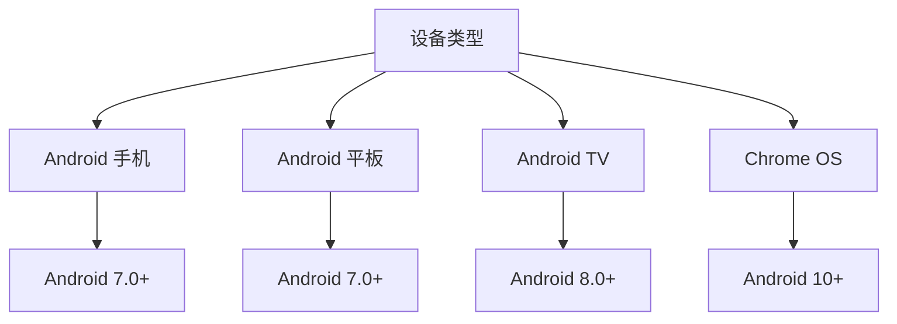

# CDroid 安装指南

本文档提供 CDroid（Container Dashboard）的完整安装和配置指南。

---

## 目录

- [系统要求](#系统要求)
- [设备要求](#设备要求)
- [环境准备](#环境准备)
- [安装步骤](#安装步骤)
- [配置说明](#配置说明)
- [验证安装](#验证安装)
- [卸载指南](#卸载指南)
- [常见问题](#常见问题)

---

## 系统要求

### 最低要求

| 要求 | 说明 |
|------|------|
| Android 版本 | Android 7.0 (API 24) 或更高 |
| 设备架构 | ARM64 (aarch64) 或 x86_64 |
| 内存 | 2GB RAM（推荐 4GB 以上） |
| 存储空间 | 500MB 可用空间（推荐 1GB 以上） |
| 网络连接 | Wi-Fi 或移动网络 |

### 推荐配置

| 配置 | 说明 |
|------|------|
| Android 版本 | Android 10 或更高 |
| 内存 | 4GB RAM 或更高 |
| 存储空间 | 2GB 可用空间 |
| 网络连接 | 稳定的网络连接 |

### 容器服务要求

| 服务 | 版本 | 说明 |
|------|------|------|
| Docker | 20.10+ | 本地或远程Docker服务 |
| Podman | 3.0+ | 本地或远程Podman服务 |
| 网络 | HTTP/HTTPS | 支持TLS加密连接 |

---

## 设备要求

### 支持的设备类型



### 检查设备兼容性

```bash
# 检查 Android 版本（需要 >= 24）
adb shell getprop ro.build.version.sdk

# 检查 CPU 架构
adb shell getprop ro.product.cpu.abi
# 应输出 arm64-v8a 或 x86_64

# 检查网络连接
adb shell ping -c 3 8.8.8.8
```

### 已知兼容设备列表

| 品牌 | 设备型号 | Android 版本 | 状态 |
|------|----------|--------------|------|
| Google | Pixel 系列 | 7.0+ | ✅ 完全支持 |
| Samsung | Galaxy 系列 | 7.0+ | ✅ 完全支持 |
| OnePlus | OnePlus 系列 | 7.0+ | ✅ 完全支持 |
| Xiaomi | Mi 系列 | 7.0+ | ✅ 完全支持 |
| Huawei | P/Mate 系列 | 7.0+ | ✅ 完全支持 |

> 完整设备支持列表请参阅 [设备支持文档](DEVICE-SUPPORT.md)

---

## 环境准备

### 1. 启用开发者选项

```
设置 → 关于手机 → 连续点击"版本号"7次
```

### 2. 启用 USB 调试

```
设置 → 开发者选项 → USB 调试 → 开启
```

### 3. 安装必要工具

```bash
# 安装 ADB（如果尚未安装）
# Ubuntu/Debian
sudo apt install android-tools-adb android-tools-fastboot

# macOS
brew install android-platform-tools

# Windows
# 从 https://developer.android.com/studio/releases/platform-tools 下载
```

### 4. 准备容器服务

```bash
# 确保Docker服务运行中
sudo systemctl status docker

# 或准备远程Docker服务
# 确保远程Docker的TCP端口已开放
# 例如：2375（非TLS）或2376（TLS）
```

---

## 安装步骤

### 方法一：通过 APK 安装（推荐）

#### 步骤 1：下载 APK

```bash
# 从 GitHub Releases 下载最新版本
wget https://github.com/your-org/cdroid/releases/download/v1.0.0/cdroid-v1.0.0.apk

# 或使用 curl
curl -L -o cdroid.apk https://github.com/your-org/cdroid/releases/latest/download/cdroid.apk
```

#### 步骤 2：安装应用

```bash
# 通过 ADB 安装
adb install cdroid.apk

# 如果已安装旧版本，使用更新安装
adb install -r cdroid.apk
```

#### 步骤 3：初始化 CDroid

```bash
# 打开应用后，按照向导完成初始化
# 或通过命令行初始化
adb shell am start -n com.cdroid.app/.MainActivity

# 配置容器服务连接
# 在应用中添加Docker Context或连接远程服务
```

### 方法二：从源码构建

#### 步骤 1：克隆仓库

```bash
git clone https://github.com/your-org/cdroid.git
cd cdroid
```

#### 步骤 2：安装依赖

```bash
# 安装 Android SDK
# 参考: https://developer.android.com/studio

# 设置环境变量
export ANDROID_HOME=/path/to/android-sdk
export PATH=$PATH:$ANDROID_HOME/tools:$ANDROID_HOME/platform-tools
```

#### 步骤 3：构建 APK

```bash
# 构建 Debug 版本
./gradlew assembleDebug

# 构建 Release 版本
./gradlew assembleRelease
```

#### 步骤 4：安装

```bash
# 安装 Debug 版本
adb install app/build/outputs/apk/debug/app-debug.apk

# 安装 Release 版本
adb install app/build/outputs/apk/release/app-release.apk
```

---

## 配置说明

### 基础配置

CDroid 配置文件位于 `/data/data/com.cdroid.app/files/config.yaml`

```yaml
# CDroid 配置文件示例

# Context 配置
contexts:
  default: local
  local:
    name: local
    type: docker
    endpoint: unix:///var/run/docker.sock
    tls: false
  
  remote:
    name: remote
    type: docker
    endpoint: tcp://192.168.1.100:2376
    tls:
      cert: /path/to/cert.pem
      key: /path/to/key.pem
      ca: /path/to/ca.pem

# Docker 配置
docker:
  # 默认超时时间（秒）
  timeout: 30
  # 日志配置
  log_level: info

# 网络配置
network:
  # 默认网络类型
  default_bridge: cdroid0
  # DNS 服务器
  dns:
    - 8.8.8.8
    - 8.8.4.4

# 日志配置
logging:
  level: info
  file: /data/data/com.cdroid.app/files/cdroid.log
```

### 高级配置

#### 多Context配置

```yaml
contexts:
  production:
    name: production
    type: docker
    endpoint: tcp://prod-server:2376
    tls: true
  
  staging:
    name: staging
    type: docker
    endpoint: tcp://staging-server:2376
    tls: true
  
  development:
    name: development
    type: podman
    endpoint: unix:///run/podman/podman.sock
```

#### 网络高级配置

```yaml
network:
  # 端口转发
  port_forwarding:
    - host_port: 8080
      guest_port: 80
      protocol: tcp
  
  # 自定义网络
  custom_networks:
    - name: mynet
      subnet: 172.20.0.0/16
      gateway: 172.20.0.1
```

---

## 验证安装

### 1. 检查应用状态

```bash
# 检查 CDroid 服务状态
adb shell am broadcast -a com.cdroid.app.CHECK_STATUS

# 预期输出
# Broadcast completed: result=0
```

### 2. 验证Context连接

```bash
# 进入 CDroid shell
adb shell run-as com.cdroid.app

# 检查 Context 状态
cdroid context ls

# 预期输出
# NAME          TYPE        ENDPOINT
# local         docker      unix:///var/run/docker.sock
# remote        docker      tcp://192.168.1.100:2376
```

### 3. 验证 Docker 连接

```bash
# 检查 Docker 版本
cdroid docker --version

# 预期输出
# Docker version 24.0.x, build xxxxx

# 运行测试容器
cdroid docker run --rm hello-world

# 预期输出
# Hello from Docker!
```

### 4. 完整验证脚本

```bash
#!/bin/bash
# CDroid 安装验证脚本

echo "=== CDroid 安装验证 ==="

echo "1. 检查应用安装..."
adb shell pm list packages | grep com.cdroid.app && echo "✅ 应用已安装" || echo "❌ 应用未安装"

echo "2. 检查网络连接..."
adb shell ping -c 3 8.8.8.8 && echo "✅ 网络可用" || echo "❌ 网络不可用"

echo "3. 检查 Context..."
cdroid context ls && echo "✅ Context配置正常" || echo "❌ Context配置异常"

echo "4. 检查 Docker..."
cdroid docker --version && echo "✅ Docker可用" || echo "❌ Docker不可用"

echo "5. 运行测试容器..."
cdroid docker run --rm hello-world && echo "✅ 容器运行正常" || echo "❌ 容器运行失败"

echo "=== 验证完成 ==="
```

---

## 卸载指南

### 完全卸载

```bash
# 1. 停止 CDroid 服务
adb shell am force-stop com.cdroid.app

# 2. 卸载应用
adb uninstall com.cdroid.app

# 3. 清理数据（可选）
adb shell rm -rf /sdcard/CDroid
```

### 保留数据卸载

```bash
# 仅卸载应用，保留数据
adb shell pm uninstall -k com.cdroid.app
```

### 清理残留文件

```bash
# 清理所有 CDroid 相关文件
adb shell
su
rm -rf /data/data/com.cdroid.app
rm -rf /data/local/tmp/cdroid
rm -rf /sdcard/CDroid
```

---

## 常见问题

### Q1: 安装失败，提示"INSTALL_FAILED_NO_MATCHING_ABIS"

**原因**：设备架构不支持

**解决方案**：
```bash
# 检查设备架构
adb shell getprop ro.product.cpu.abi
# 应输出 arm64-v8a

# 如果输出其他架构，说明设备不支持
```

### Q2: 启动失败，提示"KVM not available"

**原因**：设备不支持 KVM 或权限不足

**解决方案**：
```bash
# 检查 KVM 设备
adb shell ls -la /dev/kvm

# 如果设备不存在，说明硬件不支持
# 如果权限不足，尝试添加用户到 kvm 组
adb shell su -c "chmod 666 /dev/kvm"
```

### Q3: VM 启动超时

**原因**：资源不足或配置过高

**解决方案**：
```yaml
# 降低 VM 配置
vm:
  memory: 1024  # 降低内存
  cpus: 1       # 降低 CPU
```

### Q4: Docker 命令无响应

**原因**：Docker 服务未启动或网络问题

**解决方案**：
```bash
# 重启 CDroid 服务
adb shell am force-stop com.cdroid.app
adb shell am start -n com.cdroid.app/.MainActivity

# 检查 Docker 服务
cdroid docker info
```

---

## 下一步

安装完成后，您可以：

1. 阅读 [快速开始指南](../README.md#快速开始)
2. 了解 [CDroid 架构](ARCHITECTURE.md)
3. 查看 [Docker 集成](DOCKER-INTEGRATION.md)

---

## 相关文档

- [架构文档](ARCHITECTURE.md)
- [开发指南](DEVELOPMENT.md)
- [故障排除](TROUBLESHOOTING.md)
- [设备支持](DEVICE-SUPPORT.md)