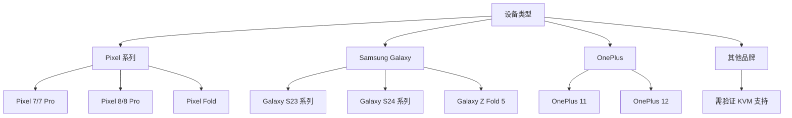

# DFA 安装指南

本文档提供 DFA（Docker For Android）的完整安装和配置指南。

---

## 目录

- [系统要求](#系统要求)
- [设备要求](#设备要求)
- [环境准备](#环境准备)
- [安装步骤](#安装步骤)
- [配置说明](#配置说明)
- [验证安装](#验证安装)
- [卸载指南](#卸载指南)
- [常见问题](#常见问题)

---

## 系统要求

### 最低要求

| 要求 | 说明 |
|------|------|
| Android 版本 | Android 13 (API 33) 或更高 |
| 设备架构 | ARM64 (aarch64) |
| 内核版本 | Linux 5.10 或更高 |
| 内存 | 4GB RAM（推荐 6GB 以上） |
| 存储空间 | 2GB 可用空间（推荐 4GB 以上） |
| CPU 特性 | 支持 ARM Virtualization Extensions |

### 推荐配置

| 配置 | 说明 |
|------|------|
| Android 版本 | Android 14 或更高 |
| 内存 | 8GB RAM 或更高 |
| 存储空间 | 8GB 可用空间 |
| CPU | 支持 KVM 的现代 ARM 处理器 |

---

## 设备要求

### 支持的设备类型



### 检查设备兼容性

```bash
# 方法1：使用 ADB 检查
adb shell getprop ro.build.version.sdk
# 输出应 >= 33

# 方法2：检查 CPU 特性
adb shell cat /proc/cpuinfo | grep -i "features"
# 应包含虚拟化相关特性

# 方法3：检查 KVM 支持
adb shell ls -la /dev/kvm
# 应显示 kvm 设备
```

### 已知兼容设备列表

| 品牌 | 设备型号 | Android 版本 | 状态 |
|------|----------|--------------|------|
| Google | Pixel 7 | 13+ | ✅ 完全支持 |
| Google | Pixel 7 Pro | 13+ | ✅ 完全支持 |
| Google | Pixel 8 | 14+ | ✅ 完全支持 |
| Google | Pixel 8 Pro | 14+ | ✅ 完全支持 |
| Samsung | Galaxy S23 | 13+ | ✅ 完全支持 |
| Samsung | Galaxy S24 | 14+ | ✅ 完全支持 |
| OnePlus | OnePlus 11 | 13+ | ⚠️ 部分支持 |
| OnePlus | OnePlus 12 | 14+ | ⚠️ 部分支持 |

> 完整设备支持列表请参阅 [设备支持文档](DEVICE-SUPPORT.md)

---

## 环境准备

### 1. 启用开发者选项

```
设置 → 关于手机 → 连续点击"版本号"7次
```

### 2. 启用 USB 调试

```
设置 → 开发者选项 → USB 调试 → 开启
```

### 3. 检查 KVM 支持

```bash
# 连接设备
adb devices

# 检查 KVM 设备
adb shell ls -la /dev/kvm
# 预期输出: crw-rw---- 1 root kvm 10, 232 ...

# 检查 KVM 权限
adb shell "groups | grep kvm"
# 应显示 kvm 组
```

### 4. 安装必要工具

```bash
# 安装 ADB（如果尚未安装）
# Ubuntu/Debian
sudo apt install android-tools-adb android-tools-fastboot

# macOS
brew install android-platform-tools

# Windows
# 从 https://developer.android.com/studio/releases/platform-tools 下载
```

---

## 安装步骤

### 方法一：通过 APK 安装（推荐）

#### 步骤 1：下载 APK

```bash
# 从 GitHub Releases 下载最新版本
wget https://github.com/your-org/dfa/releases/download/v1.0.0/dfa-v1.0.0.apk

# 或使用 curl
curl -L -o dfa.apk https://github.com/your-org/dfa/releases/latest/download/dfa.apk
```

#### 步骤 2：安装应用

```bash
# 通过 ADB 安装
adb install dfa.apk

# 如果已安装旧版本，使用更新安装
adb install -r dfa.apk
```

#### 步骤 3：初始化 DFA

```bash
# 打开应用后，按照向导完成初始化
# 或通过命令行初始化
adb shell am start -n com.dfa.app/.MainActivity

# 等待初始化完成（首次启动需要下载 VM 镜像）
```

### 方法二：从源码构建

#### 步骤 1：克隆仓库

```bash
git clone https://github.com/your-org/dfa.git
cd dfa
```

#### 步骤 2：安装依赖

```bash
# 安装 Android SDK
# 参考: https://developer.android.com/studio

# 设置环境变量
export ANDROID_HOME=/path/to/android-sdk
export PATH=$PATH:$ANDROID_HOME/tools:$ANDROID_HOME/platform-tools
```

#### 步骤 3：构建 APK

```bash
# 构建 Debug 版本
./gradlew assembleDebug

# 构建 Release 版本
./gradlew assembleRelease
```

#### 步骤 4：安装

```bash
# 安装 Debug 版本
adb install app/build/outputs/apk/debug/app-debug.apk

# 安装 Release 版本
adb install app/build/outputs/apk/release/app-release.apk
```

---

## 配置说明

### 基础配置

DFA 配置文件位于 `/data/data/com.dfa.app/files/config.yaml`

```yaml
# DFA 配置文件示例

# 虚拟机配置
vm:
  # 内存大小（MB）
  memory: 2048
  # CPU 核心数
  cpus: 2
  # 存储大小（GB）
  storage: 10

# Docker 配置
docker:
  # Docker 数据目录
  data_root: /data/docker
  # 日志配置
  log_level: info
  # 存储驱动
  storage_driver: overlay2

# 网络配置
network:
  # 默认网络类型
  default_bridge: dfa0
  # DNS 服务器
  dns:
    - 8.8.8.8
    - 8.8.4.4

# 日志配置
logging:
  level: info
  file: /data/data/com.dfa.app/files/dfa.log
```

### 高级配置

#### 虚拟机资源配置

```yaml
vm:
  # 高性能配置
  memory: 4096
  cpus: 4
  storage: 20
  
  # 启用 GPU 加速（如果支持）
  gpu:
    enabled: true
    type: virgl
```

#### 网络高级配置

```yaml
network:
  # 端口转发
  port_forwarding:
    - host_port: 8080
      guest_port: 80
      protocol: tcp
  
  # 自定义网络
  custom_networks:
    - name: mynet
      subnet: 172.20.0.0/16
      gateway: 172.20.0.1
```

---

## 验证安装

### 1. 检查应用状态

```bash
# 检查 DFA 服务状态
adb shell am broadcast -a com.dfa.app.CHECK_STATUS

# 预期输出
# Broadcast completed: result=0
```

### 2. 验证虚拟机

```bash
# 进入 DFA shell
adb shell run-as com.dfa.app

# 检查 VM 状态
dfa vm status

# 预期输出
# VM Status: Running
# Memory: 2048 MB
# CPUs: 2
```

### 3. 验证 Docker

```bash
# 检查 Docker 版本
dfa docker --version

# 预期输出
# Docker version 24.0.x, build xxxxx

# 运行测试容器
dfa docker run --rm hello-world

# 预期输出
# Hello from Docker!
```

### 4. 完整验证脚本

```bash
#!/bin/bash
# DFA 安装验证脚本

echo "=== DFA 安装验证 ==="

echo "1. 检查应用安装..."
adb shell pm list packages | grep com.dfa.app && echo "✅ 应用已安装" || echo "❌ 应用未安装"

echo "2. 检查 KVM 支持..."
adb shell ls /dev/kvm && echo "✅ KVM 可用" || echo "❌ KVM 不可用"

echo "3. 检查 VM 状态..."
dfa vm status && echo "✅ VM 运行正常" || echo "❌ VM 状态异常"

echo "4. 检查 Docker..."
dfa docker --version && echo "✅ Docker 可用" || echo "❌ Docker 不可用"

echo "5. 运行测试容器..."
dfa docker run --rm hello-world && echo "✅ 容器运行正常" || echo "❌ 容器运行失败"

echo "=== 验证完成 ==="
```

---

## 卸载指南

### 完全卸载

```bash
# 1. 停止 DFA 服务
adb shell am force-stop com.dfa.app

# 2. 卸载应用
adb uninstall com.dfa.app

# 3. 清理数据（可选）
adb shell rm -rf /sdcard/DFA
```

### 保留数据卸载

```bash
# 仅卸载应用，保留数据
adb shell pm uninstall -k com.dfa.app
```

### 清理残留文件

```bash
# 清理所有 DFA 相关文件
adb shell
su
rm -rf /data/data/com.dfa.app
rm -rf /data/local/tmp/dfa
rm -rf /sdcard/DFA
```

---

## 常见问题

### Q1: 安装失败，提示"INSTALL_FAILED_NO_MATCHING_ABIS"

**原因**：设备架构不支持

**解决方案**：
```bash
# 检查设备架构
adb shell getprop ro.product.cpu.abi
# 应输出 arm64-v8a

# 如果输出其他架构，说明设备不支持
```

### Q2: 启动失败，提示"KVM not available"

**原因**：设备不支持 KVM 或权限不足

**解决方案**：
```bash
# 检查 KVM 设备
adb shell ls -la /dev/kvm

# 如果设备不存在，说明硬件不支持
# 如果权限不足，尝试添加用户到 kvm 组
adb shell su -c "chmod 666 /dev/kvm"
```

### Q3: VM 启动超时

**原因**：资源不足或配置过高

**解决方案**：
```yaml
# 降低 VM 配置
vm:
  memory: 1024  # 降低内存
  cpus: 1       # 降低 CPU
```

### Q4: Docker 命令无响应

**原因**：Docker 服务未启动或网络问题

**解决方案**：
```bash
# 重启 DFA 服务
adb shell am force-stop com.dfa.app
adb shell am start -n com.dfa.app/.MainActivity

# 检查 Docker 服务
dfa docker info
```

---

## 下一步

安装完成后，您可以：

1. 阅读 [快速开始指南](../README.md#快速开始)
2. 了解 [DFA 架构](ARCHITECTURE.md)
3. 查看 [AVF 指南](AVF-GUIDE.md)
4. 学习 [Docker 集成](DOCKER-INTEGRATION.md)

---

## 相关文档

- [架构文档](ARCHITECTURE.md)
- [开发指南](DEVELOPMENT.md)
- [故障排除](TROUBLESHOOTING.md)
- [设备支持](DEVICE-SUPPORT.md)