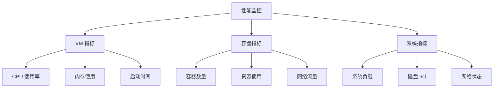
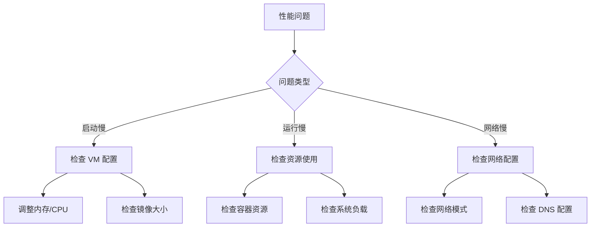

# 性能指南

本文档提供 DFA 的性能基准、优化建议和监控方法。

---

## 目录

- [性能基准](#性能基准)
- [性能监控](#性能监控)
- [优化建议](#优化建议)
- [性能调优](#性能调优)
- [性能问题排查](#性能问题排查)

---

## 性能基准

### 测试环境

| 配置项 | 规格 |
|--------|------|
| 设备 | Pixel 8 Pro |
| Android | 14 |
| 内存 | 12GB |
| 存储 | 256GB UFS 4.0 |
| DFA 版本 | 1.0.0 |

### VM 性能基准

| 指标 | 低配 (1GB/1CPU) | 中配 (2GB/2CPU) | 高配 (4GB/4CPU) |
|------|-----------------|-----------------|-----------------|
| VM 启动时间 | 8-12 秒 | 5-8 秒 | 3-5 秒 |
| VM 内存占用 | 150MB | 200MB | 350MB |
| VM CPU 占用 (空闲) | 1-2% | 2-3% | 3-5% |

### 容器性能基准

| 指标 | 低配 | 中配 | 高配 |
|------|------|------|------|
| 容器启动时间 | 3-5 秒 | 1-3 秒 | 0.5-1 秒 |
| 镜像拉取 (nginx) | 30-60 秒 | 15-30 秒 | 10-15 秒 |
| 容器内存开销 | 10-20MB | 10-20MB | 10-20MB |

### 网络性能基准

| 指标 | 数值 |
|------|------|
| TCP 吞吐量 | 500-1000 Mbps |
| UDP 吞吐量 | 400-800 Mbps |
| 延迟 (本地) | < 1ms |
| 延迟 (网络) | 取决于网络条件 |

### 存储性能基准

| 指标 | 数值 |
|------|------|
| 顺序读取 | 500-1500 MB/s |
| 顺序写入 | 300-800 MB/s |
| 随机读取 | 50-200 MB/s |
| 随机写入 | 30-100 MB/s |

---

## 性能监控

### 监控指标



### 监控命令

#### VM 监控

```bash
# 查看 VM 状态
dfa vm status

# 查看 VM 资源使用
dfa vm stats

# 实时监控
dfa vm monitor
```

#### 容器监控

```bash
# 查看容器资源使用
dfa docker stats

# 查看特定容器
dfa docker stats container-name

# 查看容器详情
dfa docker inspect container-name
```

#### 系统监控

```bash
# 查看系统信息
dfa system info

# 查看资源使用
dfa system resources

# 查看磁盘使用
dfa system df
```

### 监控 API

```bash
# 获取监控数据
curl http://localhost:8080/api/v1/metrics

# 响应示例
{
  "vm": {
    "cpu_usage": 15.5,
    "memory_used": 1024,
    "memory_total": 2048,
    "uptime": 3600
  },
  "docker": {
    "containers_running": 5,
    "containers_total": 10,
    "images": 15,
    "storage_used": 5.2
  },
  "system": {
    "cpu_usage": 25.3,
    "memory_used": 4096,
    "memory_total": 8192,
    "disk_used": 32,
    "disk_total": 64
  }
}
```

### Prometheus 集成

```yaml
# prometheus.yml
scrape_configs:
  - job_name: 'dfa'
    static_configs:
      - targets: ['localhost:8080']
    metrics_path: '/api/v1/metrics/prometheus'
```

---

## 优化建议

### VM 优化

#### 1. 内存优化

```yaml
# 根据设备内存调整 VM 配置
# 低内存设备 (< 6GB)
vm:
  memory: 1024
  cpus: 1

# 中等内存设备 (6-8GB)
vm:
  memory: 2048
  cpus: 2

# 高内存设备 (> 8GB)
vm:
  memory: 4096
  cpus: 4
```

#### 2. 启动优化

```yaml
# 启用 VM 预热
vm:
  warmup: true
  preload_images:
    - nginx:alpine
    - redis:alpine
```

#### 3. 存储优化

```yaml
# 使用高效的存储驱动
docker:
  storage_driver: overlay2
  storage_opts:
    - overlay2.size=20G
```

### 容器优化

#### 1. 使用轻量镜像

```dockerfile
# 推荐：使用 Alpine 基础镜像
FROM nginx:alpine

# 避免：使用大型基础镜像
# FROM ubuntu:latest
```

#### 2. 多阶段构建

```dockerfile
# 构建阶段
FROM golang:1.21 AS builder
WORKDIR /app
COPY . .
RUN go build -o myapp

# 运行阶段
FROM alpine:latest
COPY --from=builder /app/myapp /usr/local/bin/
CMD ["myapp"]
```

#### 3. 资源限制

```bash
# 设置合理的资源限制
dfa docker run -d \
    --memory="256m" \
    --memory-swap="512m" \
    --cpus="0.5" \
    --cpu-shares=512 \
    --pids-limit=100 \
    nginx:alpine
```

### 网络优化

#### 1. 使用 Host 网络

```bash
# 高性能场景使用 host 网络
dfa docker run -d --network host nginx
```

#### 2. 连接复用

```yaml
# 启用连接复用
network:
  connection_pool:
    enabled: true
    max_connections: 100
```

#### 3. DNS 优化

```bash
# 使用本地 DNS 缓存
dfa docker run -d \
    --dns 127.0.0.1 \
    --dns-search example.com \
    nginx
```

---

## 性能调优

### 系统调优

#### 1. 内核参数

```bash
# 在 VM 中调整内核参数
sysctl -w net.core.somaxconn=65535
sysctl -w net.ipv4.tcp_max_syn_backlog=65535
sysctl -w vm.swappiness=10
```

#### 2. 文件描述符

```bash
# 增加文件描述符限制
ulimit -n 65535
```

#### 3. I/O 调度

```bash
# 使用 noop 或 deadline 调度器
echo noop > /sys/block/sda/queue/scheduler
```

### Docker 调优

#### 1. Daemon 配置

```json
// /etc/docker/daemon.json
{
  "max-concurrent-downloads": 10,
  "max-concurrent-uploads": 5,
  "default-ulimits": {
    "nofile": {
      "Name": "nofile",
      "Hard": 65535,
      "Soft": 65535
    }
  },
  "live-restore": true,
  "userland-proxy": false
}
```

#### 2. 日志配置

```json
{
  "log-driver": "json-file",
  "log-opts": {
    "max-size": "10m",
    "max-file": "3",
    "compress": "true"
  }
}
```

#### 3. 存储配置

```json
{
  "storage-driver": "overlay2",
  "storage-opts": [
    "overlay2.size=20G",
    "overlay2.override_kernel_check=true"
  ]
}
```

### 应用调优

#### 1. JVM 调优

```bash
# Java 容器内存设置
dfa docker run -d \
    -e JAVA_OPTS="-Xms256m -Xmx512m -XX:+UseG1GC" \
    openjdk:17 java-app
```

#### 2. Node.js 调优

```bash
# Node.js 内存设置
dfa docker run -d \
    -e NODE_OPTIONS="--max-old-space-size=512" \
    node:18 node-app
```

---

## 性能问题排查

### 排查流程



### 常见问题

#### 1. VM 启动慢

**症状**: VM 启动时间超过 10 秒

**排查步骤**:
```bash
# 检查 VM 配置
dfa vm config

# 检查系统资源
dfa system resources

# 查看 VM 日志
dfa vm logs
```

**解决方案**:
- 降低 VM 内存配置
- 使用 VM 预热功能
- 检查存储性能

#### 2. 容器启动慢

**症状**: 容器启动时间超过 5 秒

**排查步骤**:
```bash
# 检查镜像大小
dfa docker images

# 检查存储性能
dfa storage benchmark

# 检查容器配置
dfa docker inspect container-name
```

**解决方案**:
- 使用更小的基础镜像
- 预拉取常用镜像
- 优化存储配置

#### 3. 网络性能差

**症状**: 网络吞吐量低或延迟高

**排查步骤**:
```bash
# 测试网络性能
dfa network test

# 检查网络配置
dfa docker network ls

# 检查 DNS
dfa docker run --rm alpine nslookup google.com
```

**解决方案**:
- 使用 host 网络模式
- 优化 DNS 配置
- 检查防火墙设置

#### 4. 内存不足

**症状**: 容器因内存不足被终止

**排查步骤**:
```bash
# 检查内存使用
dfa docker stats

# 检查系统内存
dfa system resources

# 查看容器日志
dfa docker logs container-name
```

**解决方案**:
- 增加容器内存限制
- 优化应用内存使用
- 减少并发容器数量

### 性能分析工具

```bash
# CPU 分析
dfa profile cpu --duration 30s

# 内存分析
dfa profile memory

# I/O 分析
dfa profile io --duration 30s

# 生成报告
dfa profile report > performance-report.html
```

---

## 相关文档

- [架构文档](ARCHITECTURE.md)
- [Docker 集成](DOCKER-INTEGRATION.md)
- [故障排除](TROUBLESHOOTING.md)
- [API 参考](API-REFERENCE.md)