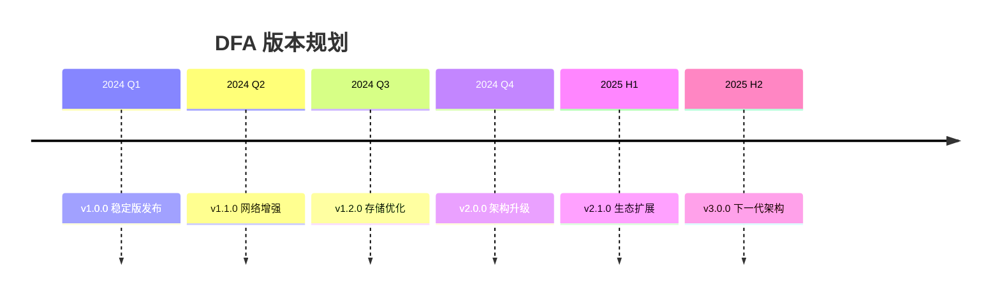
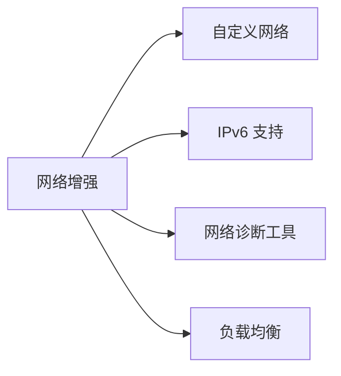
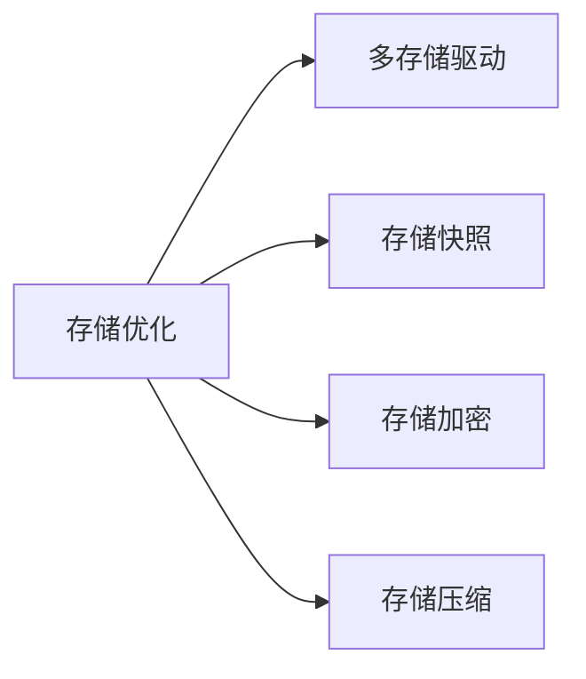
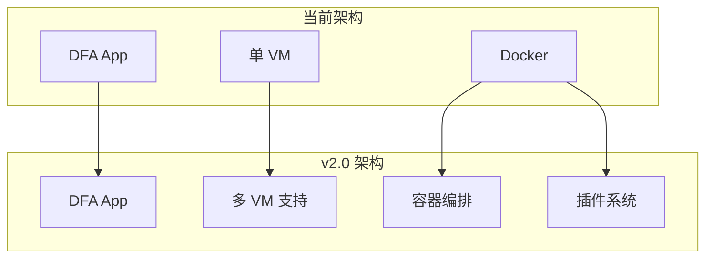
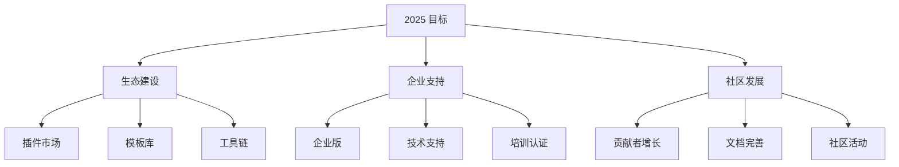
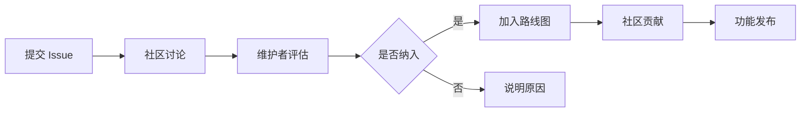

# 项目路线图

本文档描述 DFA 项目的发展规划和版本计划。

---

## 目录

- [版本规划](#版本规划)
- [功能计划](#功能计划)
- [里程碑](#里程碑)
- [长期愿景](#长期愿景)

---

## 版本规划

### 版本计划

| 版本 | 计划时间 | 主要内容 | 状态 |
|------|----------|----------|------|
| v1.0.0 | 2024 Q1 | 稳定版发布 | ✅ 已完成 |
| v1.1.0 | 2024 Q2 | 网络功能增强 | 🚧 进行中 |
| v1.2.0 | 2024 Q3 | 存储优化 | 📋 计划中 |
| v1.3.0 | 2024 Q3 | 性能优化 | 📋 计划中 |
| v2.0.0 | 2024 Q4 | 架构升级 | 📋 计划中 |

---

## 功能计划

### v1.1.0 - 网络增强 (2024 Q2)

| 功能 | 优先级 | 状态 |
|------|--------|------|
| 自定义网络配置 | 高 | 🚧 进行中 |
| IPv6 支持 | 中 | 📋 计划中 |
| 网络诊断工具 | 中 | 📋 计划中 |
| 负载均衡 | 低 | 📋 计划中 |
| 网络隔离增强 | 中 | 📋 计划中 |

### v1.2.0 - 存储优化 (2024 Q3)

| 功能 | 优先级 | 状态 |
|------|--------|------|
| 多存储驱动支持 | 高 | 📋 计划中 |
| 存储快照功能 | 高 | 📋 计划中 |
| 存储加密 | 中 | 📋 计划中 |
| 存储压缩 | 低 | 📋 计划中 |
| 远程存储支持 | 低 | 📋 计划中 |

### v1.3.0 - 性能优化 (2024 Q3)

| 功能 | 优先级 | 状态 |
|------|--------|------|
| VM 启动优化 | 高 | 📋 计划中 |
| 容器启动优化 | 高 | 📋 计划中 |
| 内存使用优化 | 中 | 📋 计划中 |
| 网络性能优化 | 中 | 📋 计划中 |
| 存储性能优化 | 中 | 📋 计划中 |

### v2.0.0 - 架构升级 (2024 Q4)

| 功能 | 优先级 | 状态 |
|------|--------|------|
| 多 VM 支持 | 高 | 📋 计划中 |
| 容器编排 (Kubernetes) | 高 | 📋 计划中 |
| 插件系统 | 中 | 📋 计划中 |
| Web 控制台 | 中 | 📋 计划中 |
| API 网关 | 低 | 📋 计划中 |

---

## 里程碑

### 里程碑 1: 稳定版发布 (v1.0.0)

**目标**: 提供稳定可靠的 Docker 容器运行环境

**完成标准**:
- [x] 核心功能稳定
- [x] 文档完善
- [x] 测试覆盖率达到 80%
- [x] 支持 10+ 设备型号

**完成时间**: 2024 Q1

### 里程碑 2: 网络增强 (v1.1.0)

**目标**: 提供完善的网络功能

**完成标准**:
- [ ] 自定义网络配置
- [ ] IPv6 支持
- [ ] 网络诊断工具
- [ ] 网络性能提升 50%

**计划时间**: 2024 Q2

### 里程碑 3: 存储优化 (v1.2.0)

**目标**: 提供灵活可靠的存储方案

**完成标准**:
- [ ] 多存储驱动支持
- [ ] 存储快照功能
- [ ] 存储加密功能
- [ ] 存储性能提升 30%

**计划时间**: 2024 Q3

### 里程碑 4: 架构升级 (v2.0.0)

**目标**: 支持企业级应用场景

**完成标准**:
- [ ] 多 VM 支持
- [ ] Kubernetes 集成
- [ ] 插件系统
- [ ] Web 控制台

**计划时间**: 2024 Q4

---

## 长期愿景

### 2025 年目标

### 功能愿景

| 功能 | 说明 | 计划时间 |
|------|------|----------|
| GPU 支持 | 支持 GPU 直通和虚拟化 | 2025 H1 |
| 分布式部署 | 支持多设备协同 | 2025 H1 |
| AI 工作负载 | 支持 AI/ML 容器 | 2025 H2 |
| 边缘计算 | 边缘场景优化 | 2025 H2 |
| 云边协同 | 云边一体化方案 | 2025 H2 |

### 生态愿景

| 方向 | 目标 |
|------|------|
| 插件生态 | 100+ 插件 |
| 模板库 | 500+ 应用模板 |
| 设备支持 | 50+ 设备型号 |
| 用户规模 | 10万+ 用户 |

---

## 参与贡献

我们欢迎社区参与路线图的制定：

1. **功能建议**: 在 GitHub Issues 中提交功能建议
2. **优先级投票**: 对计划功能进行投票
3. **代码贡献**: 参与功能开发
4. **文档贡献**: 完善项目文档

### 如何影响路线图

---

## 相关文档

- [贡献指南](../CONTRIBUTING.md)
- [开发指南](DEVELOPMENT.md)
- [架构文档](ARCHITECTURE.md)