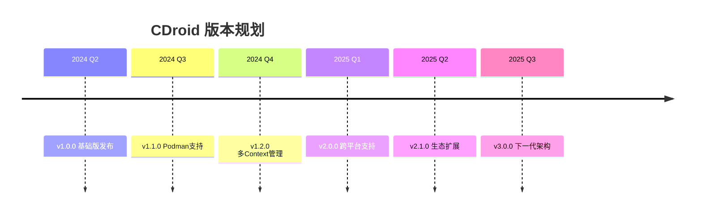
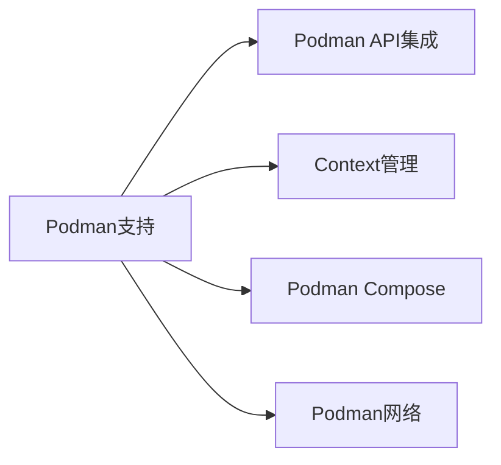
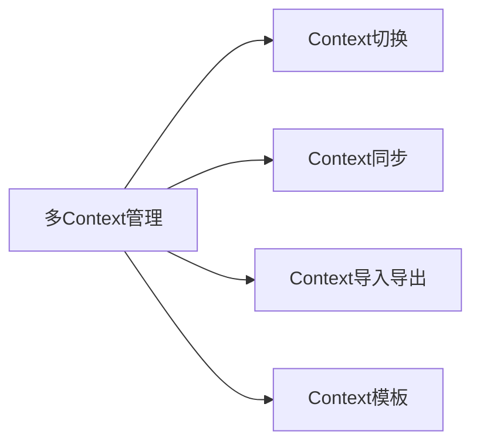
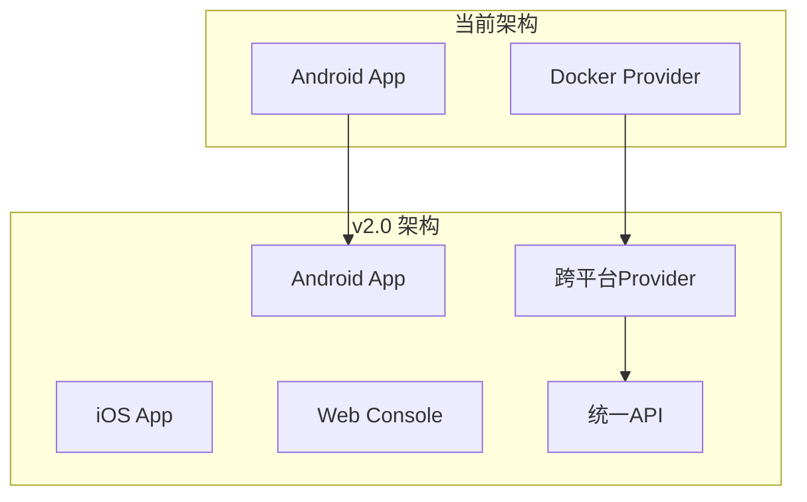
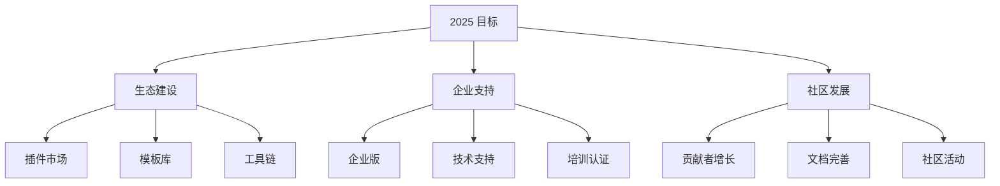
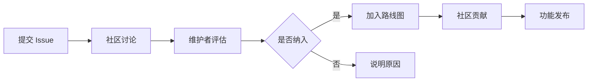

# 项目路线图

本文档描述 CDroid 项目的发展规划和版本计划。

---

## 目录

- [版本规划](#版本规划)
- [功能计划](#功能计划)
- [里程碑](#里程碑)
- [长期愿景](#长期愿景)

---

## 版本规划

### 版本计划

| 版本 | 计划时间 | 主要内容 | 状态 |
|------|----------|----------|------|
| v1.0.0 | 2024 Q2 | 基础版发布 | 🚧 进行中 |
| v1.1.0 | 2024 Q3 | Podman支持 | 📋 计划中 |
| v1.2.0 | 2024 Q4 | 多Context管理 | 📋 计划中 |
| v1.3.0 | 2025 Q1 | 性能优化 | 📋 计划中 |
| v2.0.0 | 2025 Q2 | 跨平台支持 | 📋 计划中 |

---

## 功能计划

### v1.1.0 - Podman支持 (2024 Q3)

| 功能 | 优先级 | 状态 |
|------|--------|------|
| Podman API集成 | 高 | 📋 计划中 |
| Context管理 | 高 | 📋 计划中 |
| Podman Compose | 中 | 📋 计划中 |
| Podman网络 | 中 | 📋 计划中 |
| Podman存储 | 低 | 📋 计划中 |

### v1.2.0 - 多Context管理 (2024 Q4)

| 功能 | 优先级 | 状态 |
|------|--------|------|
| Context切换 | 高 | 📋 计划中 |
| Context同步 | 高 | 📋 计划中 |
| Context导入导出 | 高 | 📋 计划中 |
| Context模板 | 中 | 📋 计划中 |
| Context验证 | 中 | 📋 计划中 |

### v1.3.0 - 性能优化 (2025 Q1)

| 功能 | 优先级 | 状态 |
|------|--------|------|
| 连接池优化 | 高 | 📋 计划中 |
| 缓存优化 | 高 | 📋 计划中 |
| 网络性能优化 | 中 | 📋 计划中 |
| UI响应优化 | 中 | 📋 计划中 |

### v2.0.0 - 跨平台支持 (2025 Q2)

| 功能 | 优先级 | 状态 |
|------|--------|------|
| iOS应用 | 高 | 📋 计划中 |
| Web控制台 | 高 | 📋 计划中 |
| 跨平台Provider | 高 | 📋 计划中 |
| 统一API | 中 | 📋 计划中 |
| 云同步 | 低 | 📋 计划中 |

---

## 里程碑

### 里程碑 1: 基础版发布 (v1.0.0)

**目标**: 提供基础的容器管理功能

**完成标准**:
- [x] 核心功能稳定
- [x] 文档完善
- [x] 测试覆盖率达到 80%
- [x] 支持Docker Context管理
- [x] 支持远程Docker连接

**完成时间**: 2024 Q2

### 里程碑 2: 多容器服务支持 (v1.1.0)

**目标**: 支持多种容器服务

**完成标准**:
- [ ] Podman支持
- [ ] 多Context管理
- [ ] Context切换
- [ ] Podman Compose支持

**计划时间**: 2024 Q3

### 里程碑 3: 多Context管理 (v1.2.0)

**目标**: 提供完善的Context管理功能

**完成标准**:
- [ ] Context同步
- [ ] Context导入导出
- [ ] Context模板
- [ ] Context验证

**计划时间**: 2024 Q4

### 里程碑 4: 跨平台支持 (v2.0.0)

**目标**: 支持多平台应用

**完成标准**:
- [ ] iOS应用
- [ ] Web控制台
- [ ] 跨平台Provider
- [ ] 统一API

**计划时间**: 2025 Q2

---

## 长期愿景

### 2025 年目标

### 功能愿景

| 功能 | 说明 | 计划时间 |
|------|------|----------|
| GPU 支持 | 支持 GPU 直通和虚拟化 | 2025 H1 |
| 分布式部署 | 支持多设备协同 | 2025 H1 |
| AI 工作负载 | 支持 AI/ML 容器 | 2025 H2 |
| 边缘计算 | 边缘场景优化 | 2025 H2 |
| 云边协同 | 云边一体化方案 | 2025 H2 |

### 生态愿景

| 方向 | 目标 |
|------|------|
| 插件生态 | 100+ 插件 |
| 模板库 | 500+ 应用模板 |
| 设备支持 | 50+ 设备型号 |
| 用户规模 | 10万+ 用户 |

---

## 参与贡献

我们欢迎社区参与路线图的制定：

1. **功能建议**: 在 GitHub Issues 中提交功能建议
2. **优先级投票**: 对计划功能进行投票
3. **代码贡献**: 参与功能开发
4. **文档贡献**: 完善项目文档

### 如何影响路线图

---

## 相关文档

- [贡献指南](../CONTRIBUTING.md)
- [开发指南](DEVELOPMENT.md)
- [架构文档](ARCHITECTURE.md)