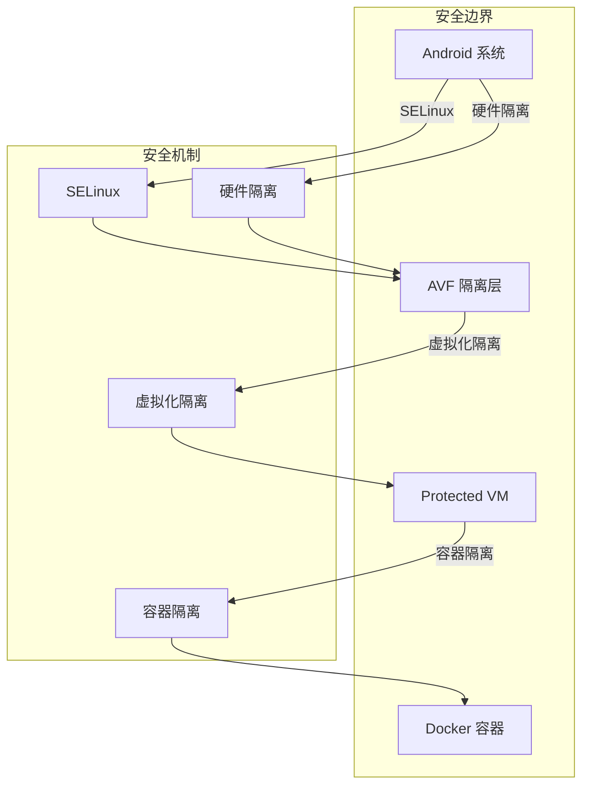
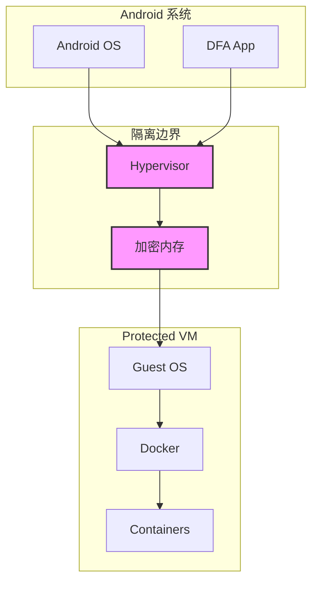
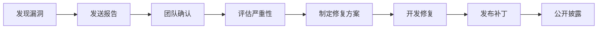
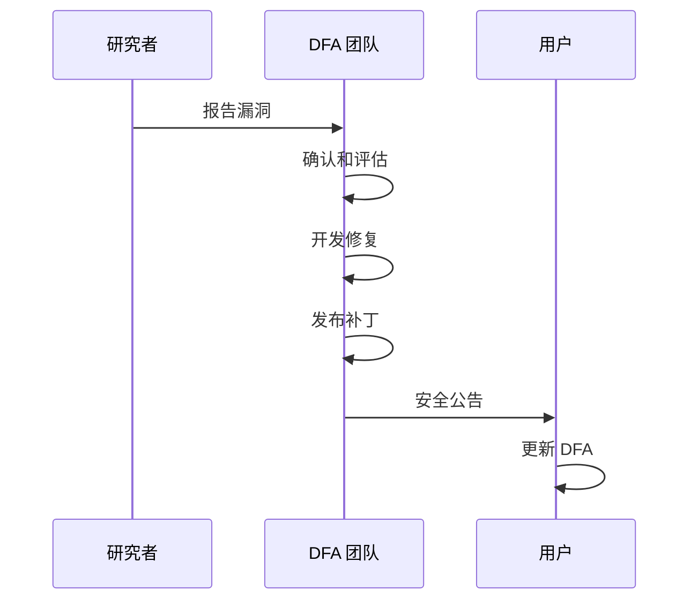

# 安全指南

本文档描述 DFA 的安全架构、最佳实践和漏洞报告流程。

---

## 目录

- [安全架构](#安全架构)
- [安全特性](#安全特性)
- [安全最佳实践](#安全最佳实践)
- [安全配置](#安全配置)
- [漏洞报告](#漏洞报告)
- [安全更新](#安全更新)

---

## 安全架构

### 多层安全模型

DFA 采用多层安全架构，确保容器运行的安全性。



### 安全层次

| 层次 | 机制 | 说明 |
|------|------|------|
| 硬件层 | ARM TrustZone | 硬件级安全隔离 |
| 虚拟化层 | AVF Protected VM | 虚拟机级隔离 |
| 容器层 | Docker Namespaces | 容器级隔离 |
| 应用层 | SELinux/AppArmor | 强制访问控制 |

### Protected VM 安全



**Protected VM 安全特性**:

- **内存隔离**: VM 拥有独立的加密内存空间
- **存储隔离**: VM 磁盘数据加密存储
- **网络隔离**: VM 网络与宿主网络隔离
- **访问控制**: 宿主无法直接访问 VM 内部

---

## 安全特性

### 1. 虚拟化隔离

```kotlin
// 使用 Protected VM
val config = VirtualMachineConfig.Builder(context)
    .setProtectedVm(true)  // 启用保护模式
    .setMemoryBytes(2048 * 1024 * 1024L)
    .build()
```

### 2. 容器隔离

Docker 容器使用多种隔离技术：

| 隔离类型 | 说明 |
|----------|------|
| PID Namespace | 进程 ID 隔离 |
| Network Namespace | 网络隔离 |
| Mount Namespace | 文件系统隔离 |
| UTS Namespace | 主机名隔离 |
| IPC Namespace | 进程间通信隔离 |
| User Namespace | 用户权限隔离 |

### 3. 资源限制

```bash
# 内存限制
dfa docker run --memory="512m" nginx

# CPU 限制
dfa docker run --cpus="1.0" nginx

# 进程数限制
dfa docker run --pids-limit=100 nginx

# 文件描述符限制
dfa docker run --ulimit nofile=1024:2048 nginx
```

### 4. 能力控制

```bash
# 移除所有能力
dfa docker run --cap-drop ALL nginx

# 只添加需要的能力
dfa docker run --cap-drop ALL --cap-add NET_BIND_SERVICE nginx

# 禁止特权提升
dfa docker run --security-opt no-new-privileges nginx
```

### 5. 安全配置

```bash
# 只读根文件系统
dfa docker run --read-only nginx

# 禁止新的特权
dfa docker run --security-opt no-new-privileges nginx

# AppArmor 配置
dfa docker run --security-opt apparmor=docker-default nginx

# Seccomp 配置
dfa docker run --security-opt seccomp=unconfined nginx
```

---

## 安全最佳实践

### 容器安全

#### 1. 使用非 root 用户

```dockerfile
# Dockerfile
FROM nginx:alpine

# 创建非 root 用户
RUN addgroup -S appgroup && adduser -S appuser -G appgroup

# 切换到非 root 用户
USER appuser

# 设置工作目录
WORKDIR /app
```

```bash
# 运行时指定用户
dfa docker run --user 1000:1000 nginx
```

#### 2. 最小化镜像

```dockerfile
# 使用最小化基础镜像
FROM alpine:latest

# 只安装必要的包
RUN apk add --no-cache nginx

# 清理缓存
RUN rm -rf /var/cache/apk/*
```

#### 3. 镜像安全扫描

```bash
# 扫描镜像漏洞
dfa docker scout cve nginx:latest

# 查看镜像安全报告
dfa docker scout quickview nginx:latest
```

#### 4. 使用可信镜像

```bash
# 使用官方镜像
dfa docker pull nginx:official

# 使用签名镜像
dfa docker pull nginx@sha256:xxx

# 验证镜像签名
dfa docker trust inspect nginx:latest
```

### 网络安全

#### 1. 网络隔离

```bash
# 创建隔离网络
dfa docker network create --internal isolated-net

# 使用隔离网络
dfa docker run --network isolated-net nginx
```

#### 2. 端口限制

```bash
# 只绑定到本地
dfa docker run -p 127.0.0.1:8080:80 nginx

# 避免使用特权端口
dfa docker run -p 8080:80 nginx
```

#### 3. 网络策略

```yaml
# 网络策略配置
networkPolicy:
  ingress:
    - from:
        - podSelector:
            matchLabels:
              app: frontend
      ports:
        - port: 80
  egress:
    - to:
        - podSelector:
            matchLabels:
              app: database
      ports:
        - port: 3306
```

### 存储安全

#### 1. 数据卷安全

```bash
# 使用命名卷
dfa docker volume create --driver local \
    --opt type=tmpfs \
    --opt device=tmpfs \
    --opt o=size=100m,uid=1000 \
    secure-vol

# 只读挂载
dfa docker run -v data:/data:ro nginx
```

#### 2. 敏感数据处理

```bash
# 使用 Docker Secrets
echo "my_secret_password" | dfa docker secret create db_password -

# 在容器中使用 Secret
dfa docker service create \
    --secret db_password \
    --env DB_PASSWORD_FILE=/run/secrets/db_password \
    my-app
```

---

## 安全配置

### DFA 安全配置

```yaml
# /data/data/com.dfa.app/files/config.yaml

security:
  # VM 安全配置
  vm:
    protected: true           # 使用 Protected VM
    memory_encryption: true   # 启用内存加密
    secure_boot: true         # 启用安全启动
  
  # 容器安全配置
  container:
    default_user: "1000:1000" # 默认用户
    no_new_privileges: true   # 禁止特权提升
    read_only_rootfs: false   # 只读根文件系统
    
  # 网络安全配置
  network:
    default_bridge: isolated  # 默认网络隔离
    dns_over_tls: true        # DNS over TLS
    firewall_enabled: true    # 启用防火墙
    
  # 审计配置
  audit:
    enabled: true             # 启用审计
    log_level: info           # 日志级别
    retention_days: 30        # 日志保留天数
```

### Docker 安全配置

```json
// /etc/docker/daemon.json
{
  "icc": false,
  "live-restore": true,
  "userland-proxy": false,
  "no-new-privileges": true,
  "default-ulimits": {
    "nofile": {
      "Name": "nofile",
      "Hard": 1024,
      "Soft": 1024
    }
  },
  "log-driver": "json-file",
  "log-opts": {
    "max-size": "10m",
    "max-file": "3"
  }
}
```

---

## 漏洞报告

### 报告流程



### 报告方式

**请勿在公开 Issue 中报告安全漏洞！**

请通过以下方式报告安全漏洞：

1. **GitHub Security Advisories**
   - 访问: https://github.com/your-org/dfa/security/advisories
   - 点击 "Report a vulnerability"

2. **邮件报告**
   - 邮箱: security@dfa-project.org
   - 使用 PGP 加密（可选）

### 报告内容

请包含以下信息：

```markdown
## 漏洞描述
[详细描述漏洞]

## 影响范围
[受影响的版本和组件]

## 复现步骤
1. 
2. 
3. 

## 概念验证
[如有，提供 PoC 代码]

## 建议修复
[如有，提供修复建议]

## 联系方式
[您的联系方式]
```

### 响应时间

| 严重性 | 响应时间 | 修复时间 |
|--------|----------|----------|
| 严重 | 24 小时 | 7 天 |
| 高 | 48 小时 | 14 天 |
| 中 | 72 小时 | 30 天 |
| 低 | 7 天 | 90 天 |

### 漏洞奖励

我们感谢安全研究者的贡献，将给予：

- 公开致谢
- CVE 编号申请
- 安全贡献者名单

---

## 安全更新

### 订阅安全公告

```bash
# 订阅安全公告 RSS
# https://github.com/your-org/dfa/security/advisories.atom

# 或关注 GitHub Security Advisories
```

### 检查更新

```bash
# 检查 DFA 更新
dfa update check

# 安装安全更新
dfa update install --security-only

# 查看当前版本
dfa version
```

### 安全更新流程



---

## 安全检查清单

### 部署前检查

- [ ] 使用 Protected VM
- [ ] 配置资源限制
- [ ] 使用非 root 用户运行容器
- [ ] 配置网络隔离
- [ ] 启用审计日志
- [ ] 更新到最新版本

### 运行时检查

- [ ] 监控容器资源使用
- [ ] 定期扫描镜像漏洞
- [ ] 检查异常网络连接
- [ ] 审查审计日志
- [ ] 备份重要数据

### 定期维护

- [ ] 更新安全补丁
- [ ] 轮换密钥和证书
- [ ] 清理未使用资源
- [ ] 审查安全配置
- [ ] 进行安全审计

---

## 相关文档

- [架构文档](ARCHITECTURE.md)
- [Docker 集成](DOCKER-INTEGRATION.md)
- [故障排除](TROUBLESHOOTING.md)
- [FAQ](FAQ.md)